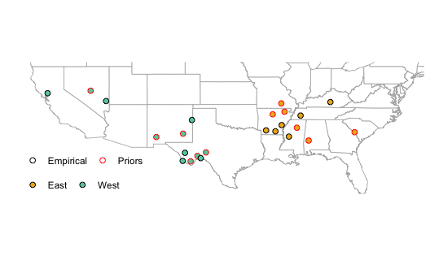
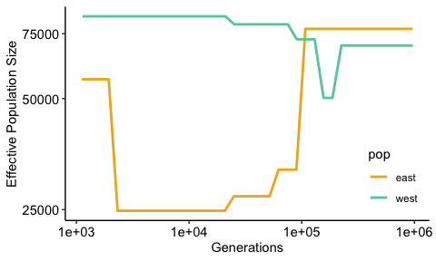
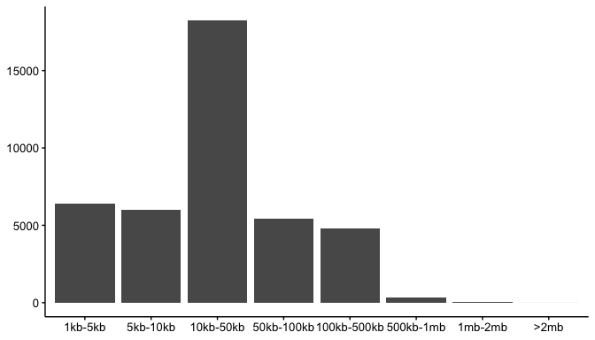
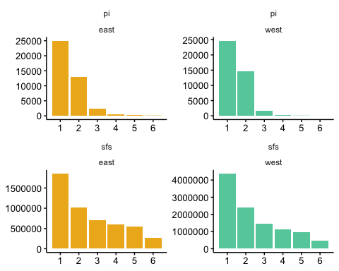

Mainland ABC
================

-   [Samples](#samples)
-   [Priors](#priors)
    -   [SMC++ output](#smc-output)
    -   [Distributions for Sampling](#distributions-for-sampling)
    -   [Recombination Rates](#recombination-rates)
-   [Neutral Genome](#neutral-genome)
    -   [Genic Regions](#genic-regions)
-   [Summary Statistics](#summary-statistics)

## Samples

<table class="table" style="width: auto !important; margin-left: auto; margin-right: auto;">
<thead>
<tr>
<th style="border-bottom:hidden;padding-bottom:0; padding-left:3px;padding-right:3px;text-align: center; " colspan="2">

<div style="border-bottom: 1px solid #ddd; padding-bottom: 5px; ">

Empirical

</div>

</th>
<th style="border-bottom:hidden;padding-bottom:0; padding-left:3px;padding-right:3px;text-align: center; " colspan="2">

<div style="border-bottom: 1px solid #ddd; padding-bottom: 5px; ">

Priors

</div>

</th>
</tr>
<tr>
<th style="border-bottom:hidden;padding-bottom:0; padding-left:3px;padding-right:3px;text-align: center; " colspan="1">

<div style="border-bottom: 1px solid #ddd; padding-bottom: 5px; ">

East

</div>

</th>
<th style="border-bottom:hidden;padding-bottom:0; padding-left:3px;padding-right:3px;text-align: center; " colspan="1">

<div style="border-bottom: 1px solid #ddd; padding-bottom: 5px; ">

West

</div>

</th>
<th style="border-bottom:hidden;padding-bottom:0; padding-left:3px;padding-right:3px;text-align: center; " colspan="1">

<div style="border-bottom: 1px solid #ddd; padding-bottom: 5px; ">

East

</div>

</th>
<th style="border-bottom:hidden;padding-bottom:0; padding-left:3px;padding-right:3px;text-align: center; " colspan="1">

<div style="border-bottom: 1px solid #ddd; padding-bottom: 5px; ">

West

</div>

</th>
</tr>
</thead>
<tbody>
<tr>
<td style="text-align:left;">
SRR24465306
</td>
<td style="text-align:left;">
SRR24465296
</td>
<td style="text-align:left;">
SRR24465268
</td>
<td style="text-align:left;">
SRR24465287
</td>
</tr>
<tr>
<td style="text-align:left;">
SRR24465269
</td>
<td style="text-align:left;">
SRR24465288
</td>
<td style="text-align:left;">
SRR24465309
</td>
<td style="text-align:left;">
SRR24465284
</td>
</tr>
<tr>
<td style="text-align:left;">
SRR24465307
</td>
<td style="text-align:left;">
SRR24465292
</td>
<td style="text-align:left;">
SRR24465270
</td>
<td style="text-align:left;">
SRR24465283
</td>
</tr>
<tr>
<td style="text-align:left;">
SRR24465297
</td>
<td style="text-align:left;">
SRR24465293
</td>
<td style="text-align:left;">
SRR24465308
</td>
<td style="text-align:left;">
SRR24465290
</td>
</tr>
<tr>
<td style="text-align:left;">
SRR24465272
</td>
<td style="text-align:left;">
SRR24465285
</td>
<td style="text-align:left;">
SRR24465271
</td>
<td style="text-align:left;">
SRR24465289
</td>
</tr>
<tr>
<td style="text-align:left;">
SRR24465305
</td>
<td style="text-align:left;">
SRR24465294
</td>
<td style="text-align:left;">
SRR24465304
</td>
<td style="text-align:left;">
SRR24465291
</td>
</tr>
</tbody>
</table>

<!-- -->

## Priors

### SMC++ output

<!-- -->
<table class="table" style="width: auto !important; margin-left: auto; margin-right: auto;">
<thead>
<tr>
<th style="border-bottom:hidden;padding-bottom:0; padding-left:3px;padding-right:3px;text-align: center; " colspan="3">

<div style="border-bottom: 1px solid #ddd; padding-bottom: 5px; ">

East

</div>

</th>
<th style="border-bottom:hidden;padding-bottom:0; padding-left:3px;padding-right:3px;text-align: center; " colspan="3">

<div style="border-bottom: 1px solid #ddd; padding-bottom: 5px; ">

West

</div>

</th>
</tr>
<tr>
<th style="border-bottom:hidden;padding-bottom:0; padding-left:3px;padding-right:3px;text-align: center; " colspan="1">

<div style="border-bottom: 1px solid #ddd; padding-bottom: 5px; ">

Ne

</div>

</th>
<th style="border-bottom:hidden;padding-bottom:0; padding-left:3px;padding-right:3px;text-align: center; " colspan="1">

<div style="border-bottom: 1px solid #ddd; padding-bottom: 5px; ">

end

</div>

</th>
<th style="border-bottom:hidden;padding-bottom:0; padding-left:3px;padding-right:3px;text-align: center; " colspan="1">

<div style="border-bottom: 1px solid #ddd; padding-bottom: 5px; ">

start

</div>

</th>
<th style="border-bottom:hidden;padding-bottom:0; padding-left:3px;padding-right:3px;text-align: center; " colspan="1">

<div style="border-bottom: 1px solid #ddd; padding-bottom: 5px; ">

Ne

</div>

</th>
<th style="border-bottom:hidden;padding-bottom:0; padding-left:3px;padding-right:3px;text-align: center; " colspan="1">

<div style="border-bottom: 1px solid #ddd; padding-bottom: 5px; ">

end

</div>

</th>
<th style="border-bottom:hidden;padding-bottom:0; padding-left:3px;padding-right:3px;text-align: center; " colspan="1">

<div style="border-bottom: 1px solid #ddd; padding-bottom: 5px; ">

start

</div>

</th>
</tr>
</thead>
<tbody>
<tr>
<td style="text-align:right;">
77000
</td>
<td style="text-align:right;">
965000
</td>
<td style="text-align:right;">
108000
</td>
<td style="text-align:right;">
70000
</td>
<td style="text-align:right;">
968000
</td>
<td style="text-align:right;">
225000
</td>
</tr>
<tr>
<td style="text-align:right;">
32000
</td>
<td style="text-align:right;">
90000
</td>
<td style="text-align:right;">
62000
</td>
<td style="text-align:right;">
50000
</td>
<td style="text-align:right;">
187000
</td>
<td style="text-align:right;">
156000
</td>
</tr>
<tr>
<td style="text-align:right;">
27000
</td>
<td style="text-align:right;">
52000
</td>
<td style="text-align:right;">
25000
</td>
<td style="text-align:right;">
72000
</td>
<td style="text-align:right;">
130000
</td>
<td style="text-align:right;">
90000
</td>
</tr>
<tr>
<td style="text-align:right;">
25000
</td>
<td style="text-align:right;">
21000
</td>
<td style="text-align:right;">
2000
</td>
<td style="text-align:right;">
80000
</td>
<td style="text-align:right;">
75000
</td>
<td style="text-align:right;">
25000
</td>
</tr>
<tr>
<td style="text-align:right;">
56000
</td>
<td style="text-align:right;">
2000
</td>
<td style="text-align:right;">
1000
</td>
<td style="text-align:right;">
84000
</td>
<td style="text-align:right;">
21000
</td>
<td style="text-align:right;">
1000
</td>
</tr>
</tbody>
</table>

### Distributions for Sampling

<table class="table" style="width: auto !important; margin-left: auto; margin-right: auto;">
<thead>
<tr>
<th style="empty-cells: hide;border-bottom:hidden;" colspan="1">
</th>
<th style="border-bottom:hidden;padding-bottom:0; padding-left:3px;padding-right:3px;text-align: center; " colspan="2">

<div style="border-bottom: 1px solid #ddd; padding-bottom: 5px; ">

East

</div>

</th>
<th style="border-bottom:hidden;padding-bottom:0; padding-left:3px;padding-right:3px;text-align: center; " colspan="2">

<div style="border-bottom: 1px solid #ddd; padding-bottom: 5px; ">

West

</div>

</th>
</tr>
<tr>
<th style="border-bottom:hidden;padding-bottom:0; padding-left:3px;padding-right:3px;text-align: center; " colspan="1">

<div style="border-bottom: 1px solid #ddd; padding-bottom: 5px; ">

Variable

</div>

</th>
<th style="border-bottom:hidden;padding-bottom:0; padding-left:3px;padding-right:3px;text-align: center; " colspan="1">

<div style="border-bottom: 1px solid #ddd; padding-bottom: 5px; ">

Min

</div>

</th>
<th style="border-bottom:hidden;padding-bottom:0; padding-left:3px;padding-right:3px;text-align: center; " colspan="1">

<div style="border-bottom: 1px solid #ddd; padding-bottom: 5px; ">

Max

</div>

</th>
<th style="border-bottom:hidden;padding-bottom:0; padding-left:3px;padding-right:3px;text-align: center; " colspan="1">

<div style="border-bottom: 1px solid #ddd; padding-bottom: 5px; ">

Min

</div>

</th>
<th style="border-bottom:hidden;padding-bottom:0; padding-left:3px;padding-right:3px;text-align: center; " colspan="1">

<div style="border-bottom: 1px solid #ddd; padding-bottom: 5px; ">

Max

</div>

</th>
</tr>
</thead>
<tbody>
<tr>
<td style="text-align:left;">
NeCurr
</td>
<td style="text-align:right;">
40000
</td>
<td style="text-align:right;">
70000
</td>
<td style="text-align:right;">
55000
</td>
<td style="text-align:right;">
100000
</td>
</tr>
<tr>
<td style="text-align:left;">
NeThree
</td>
<td style="text-align:right;">
60000
</td>
<td style="text-align:right;">
90000
</td>
<td style="text-align:right;">
55000
</td>
<td style="text-align:right;">
85000
</td>
</tr>
<tr>
<td style="text-align:left;">
NeTwo
</td>
<td style="text-align:right;">
10000
</td>
<td style="text-align:right;">
50000
</td>
<td style="text-align:right;">
35000
</td>
<td style="text-align:right;">
65000
</td>
</tr>
<tr>
<td style="text-align:left;">
TimeOne
</td>
<td style="text-align:right;">
1
</td>
<td style="text-align:right;">
7500
</td>
<td style="text-align:right;">
115000
</td>
<td style="text-align:right;">
170000
</td>
</tr>
<tr>
<td style="text-align:left;">
TimeTwo
</td>
<td style="text-align:right;">
75000
</td>
<td style="text-align:right;">
125000
</td>
<td style="text-align:right;">
170000
</td>
<td style="text-align:right;">
240000
</td>
</tr>
</tbody>
</table>

### Recombination Rates

Obtained from running pyrho (and SMC++) on east (n=14) and west (n=12)
separately

Genome-wide recombination rate average and standard deviation used to
determine gamma distribution for sampling

**East**

> RecRateBp\_east = random.gammavariate(0.5591, 0.00000002403)

**West**

> RecRateBp\_west = random.gammavariate(0.9469, 0.00000002202)

## Neutral Genome

From dog annotation liftover, identify canoncial coding sequence
coordinates to be removed

### Genic Regions

create bed file of genes ±1kb from annotation

<details>
<summary>
Show code
</summary>

<br>

``` r
#Grayfox liftover annotation

galba <- fread("~/Downloads/galba.gtf.gz")


chroms <- read_tsv("inputstats_files/grayfox_renameChroms_number.txt", col_names = c("scaf","chrom")) %>% 
  separate(scaf, remove=F, c(NA,NA,NA,NA,NA,"length"))

gfgenes <- galba %>% left_join(chroms,by=c("V1"="scaf"))


mybednew <- gfgenes %>% 
  filter(str_detect(V3, "CDS")) %>% mutate(len=V5-V4) %>% separate(V9, sep=";", into=c("t","g"))

mybeds <- mybednew %>%  mutate(g = str_remove_all(g, "\"")) %>% separate(g, sep="d", into=c("id","gid")) %>% mutate(gid=as.numeric(str_remove(gid,"g"))) %>% arrange(gid,len)

mb <- mybeds %>% group_by(gid) %>% filter(len==max(len)) %>% drop_na(chrom) %>% ungroup()


mb1kb %>% write_tsv("sumstats_files/gfgenes_2024_1kb.bed", col_names = F)

## take the intersect to get neutral regions


neutral <- read_tsv("sumstats_files/neutral.bed", col_names = c("chrom","start","end")) %>% mutate(size=end-start) 

neutral %>% filter(size>1000)  %>% dplyr::select(chrom,start,end) %>%  write_tsv("sumstats_files/neutral_regions_gt1kb.bed", col_names = F)

neutralsmall <- neutral %>% filter(size<1000) %>% dplyr::select(chrom,start,end)

mbgt1kb <- bind_rows(mb1kb,neutralsmall) %>% arrange(chrom,start)

mbgt1kb %>% write_tsv("sumstats_files/gfgenes_2024_1kb_gt1kb.bed", col_names = F)
```

</details>

<!-- -->

## Summary Statistics

Do for empirical subset of samples (n=6) per pop

<!-- -->

#### Generate site frequency spectra for east and west populations

<details>
<summary>
Show code for getting allele counts
</summary>

<br>

``` bash
##Filter for six empirical samples per pop

bcftools view -Oz -S west6.txt /project/jazlynmo_738/DataRepository/Canids/Variants/GrayFox/Mainland/grayfox_filtered.renameChroms.Mainland.drop295.ACgr59_DPgr205lt500.vcf.gz > west6.vcf.gz

bcftools view -Oz -S east6.txt /project/jazlynmo_738/DataRepository/Canids/Variants/GrayFox/Mainland/grayfox_filtered.renameChroms.Mainland.drop295.ACgr59_DPgr205lt500.vcf.gz > east6.vcf.gz

bcftools index -t west6.vcf.gz

bcftools index -t east6.vcf.gz

##Filter for SNPs among sample set
bcftools view --min-ac=1 --max-ac 11 west6.vcf.gz | bcftools view -i 'F_MISSING<0.1' -Oz -o snpwest6.vcf.gz

bcftools index -t snpwest6.vcf.gz

bcftools view --min-ac=1 --max-ac 11 east6.vcf.gz | bcftools view -i 'F_MISSING<0.1' -Oz -o snpeast6.vcf.gz

bcftools index -t snpeast6.vcf.gz


##Get allele counts
vcftools --gzvcf snpeast6.vcf.gz --counts --out eastcount_neutral --exclude-bed gfgenes_2024_1kb_gt1kb.bed >& eastcount_neutral.log

vcftools --gzvcf snpwest6.vcf.gz --counts --out westcount_neutral --exclude-bed gfgenes_2024_1kb_gt1kb.bed >& westcount_neutral.log

sed -e 's/:/\t/g'  eastcount_neutral.frq.count > east_neutral.count

sed -e 's/:/\t/g'  westcount_neutral.frq.count > west_neutral.count
```

</details>

<br>

#### Bin allele counts to get site frequency spectrum

<details>
<summary>
Show code for binning allele counts
</summary>

<br>

``` r
eastcount <- fread("/scratch1/marjanak/mainland_2024/gf_correct/east_neutral.count",col.names = c("CHROM","POS","N_ALLELES","N_CHR","allele1","count1","allele2","count2"))

sumeast <- eastcount %>% group_by(count1,count2) %>% count()

east_data <- sumeast %>%
  group_by(bin = pmin(count1, count2), bin2 = pmax(count1, count2)) %>%
  summarise(count = sum(n), .groups = 'drop') %>%
  arrange(bin) %>% select(bin,count)

westcount <- fread("/scratch1/marjanak/mainland_2024/gf_correct/west_neutral.count",col.names = c("CHROM","POS","N_ALLELES","N_CHR","allele1","count1","allele2","count2"))

sumwest <- westcount %>% group_by(count1,count2) %>% count()

west_data <- sumwest %>%
  group_by(bin = pmin(count1, count2), bin2 = pmax(count1, count2)) %>%
  summarise(count = sum(n), .groups = 'drop') %>%
  arrange(bin) %>% select(bin,count)

snpbin <- bind_rows("east"=east_data, "west"=west_data, .id="pop")

statsbin <- bind_rows("pi"=pibin,"sfs"=snpbin,.id="stat")

write_tsv(statsbin,"/scratch1/marjanak/mainland_2024/gf_correct/emp_bin_summary.txt")
```

</details>

<br>

#### Calculate per-site nucleotide diversity (pi) in east and west using gVCFs

<details>
<summary>
Show code for per chrom job array
</summary>

<br>

``` bash
#!/bin/sh
#SBATCH --job-name=sitepiE
#SBATCH --output=/scratch1/marjanak/mainland_2024/gf_correct/pi_east/slurmJob_%a.out
#SBATCH --error=/scratch1/marjanak/mainland_2024/gf_correct/pi_east/slurmJob_%a.err
#SBATCH --time=30:00:00
#SBATCH --partition=qcb
#SBATCH --ntasks=1
#SBATCH --cpus-per-task=4
#SBATCH --mem-per-cpu=8000MB
#SBATCH --array=1-32
#SBATCH --mail-type=END,FAIL # notifications for job done & fail
#SBATCH --mail-user=marjanak@usc.edu

module load vcftools

vcftools --gzvcf /project/jazlynmo_738/DataRepository/Canids/Invariant/GrayFox/Mainland/grayfox_filtered.renameChroms.Mainland.drop295.ACgr59_DPgr205lt500.rmMultAllelicgvcf.gz --keep east6.txt --site-pi --max-missing 1.0 --chr chr${SLURM_ARRAY_TASK_ID} --out /scratch1/marjanak/mainland_2024/gf_correct/pi_east/chr${SLURM_ARRAY_TASK_ID}sitepi_East

sleep 60
```

</details>

<br>

#### Calculate nucleotide diversity in neutral regions

<details>
<summary>
Show code for getting nucelotide diversity
</summary>

<br>

``` bash
#Skip header and combine site pi per chrom outputs
awk 'FNR>1' chr* > east_sites.pi

#Delete lines with pi of zero
awk '$3 != 0' east_sites.pi > allChroms.sites.pi

#Convert to bed format
awk 'OFS="\t"{print $1, $2-1, $2, $3}' allChroms.sites.pi > allChroms.sites.bed


#Intersect per site pi and neutral region bed files to calculate avg pi per region 
bedtools intersect -a neutral_regions_gt1kb.bed -b allChroms.sites.bed -wa -wb > intersected_sites.bed
```

</details>

<br>

#### Bin Nucelotide Diversity

<details>
<summary>
Show code for binning nucleotide diversity
</summary>

<br>

``` r
eastint <- read_tsv("/scratch1/marjanak/mainland_2024/gf_correct/pi_east/intersected_sites.bed",
                    col_names = c("chr","start","end","chrom","x","y","pi"))

westint <- read_tsv("/scratch1/marjanak/mainland_2024/gf_correct/pi_west/intersected_sites.bed",
                    col_names = c("chr","start","end","chrom","x","y","pi"))


allneut <- read_tsv("/scratch1/marjanak/mainland_2024/gf_correct/pi_east/neutral_regions_gt1kb.bed",
                    col_names = c("chr","start","end"))

eastneut <- allneut %>% 
  left_join(eastint, by = c("chr","start","end")) 

counteast <- eastneut %>% 
  mutate(pie=case_when(is.na(pi) ~ 0, TRUE ~ pi)) %>% 
  group_by(chr,start,end) %>% 
  summarise(n=n(), sumpi=sum(pie)) %>% 
  mutate(size=end-start, avgpi=sumpi/size) %>% 
  mutate(cutsize=cut(avgpi,c(-Inf,0.0008,0.0016,0.0024,0.0032,0.004,Inf),
                     labels = c("nd_1","nd_2","nd_3","nd_4","nd_5","nd_6")))

cte <- counteast %>% group_by(cutsize) %>% summarise(regs=n())

westneut <- allneut %>% 
  left_join(westint, by = c("chr","start","end")) 

countwest <- westneut %>% 
  mutate(pie=case_when(is.na(pi) ~ 0, TRUE ~ pi)) %>% 
  group_by(chr,start,end) %>% 
  summarise(n=n(), sumpi=sum(pie)) %>% 
  mutate(size=end-start, avgpi=sumpi/size) %>% 
  mutate(cutsize=cut(avgpi,c(-Inf,0.0017,0.0034,0.0051,0.0068,0.0085,Inf), 
                     labels = c("nd_1","nd_2","nd_3","nd_4","nd_5","nd_6")))

ctw <- countwest %>% group_by(cutsize) %>% summarise(regs=n())

pibin <- bind_rows("east"=cte, "west"=ctw, .id="pop") %>% mutate(bin=as.integer(bin))
```

</details>

<br>
