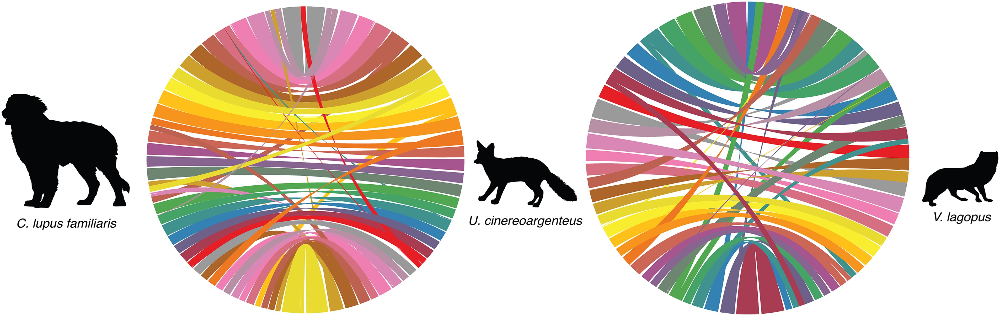

```{r setup, include=FALSE, warning=FALSE, message=FALSE}
knitr::opts_chunk$set(echo = TRUE)
library(tidyverse)
library(knitr)
library(rmarkdown)
library(usmap)
library(data.table)
library(scales)
library(janitor)
library(kableExtra)
library(ggpubr)
library(gridExtra)
library(grid)
library(RColorBrewer)
```

## Reference genome

>Armstrong et al. (2024). Chromosome-level assembly of the gray fox (Urocyon cinereoargenteus) confirms the basal loss of PRDM9 in Canidae, G3 Genes|Genomes|Genetics, 14:4jkae034, https://doi.org/10.1093/g3journal/jkae034



## Samples 

Whole genome sequencing of gray fox 

Data from [ncbi.nlm.nih.gov/bioproject/PRJNA966176/](https://www.ncbi.nlm.nih.gov/bioproject/PRJNA966176/)

>Preckler-Quisquater et al. (2023). Can demographic histories explain long-term isolation and recent pulses of asymmetric gene flow between highly divergent grey fox lineages? Molecular Ecology, 32, 5323–5337. https://doi.org/10.1111/mec.17105


Filter VCF for minor allele frequency = 0.05 and remove missing data

```{bash filterVCF,eval=F}
vcftools --gzvcf grayfox_filtered.renameChroms.Mainland.drop295.QUAL30_DPgr205lt500_ANgr59.vcf.gz --maf 0.05 --max-missing 1 --recode --out grayfox_n41
```

### PCA

Conduct principal component analysis on resulting VCF

```{r runPCA, eval=F}
library("SNPRelate")

# Read in VCF with all 41 samples
vcf.fn <-"grayfox_n41.recode.vcf"
snpgdsVCF2GDS(vcf.fn, "ccm.gds",  method="biallelic.only")
genofile <- openfn.gds("ccm.gds")
ccm_pca<-snpgdsPCA(genofile)

pca <- ccm_pca$eigenval[1:20]
pca_perc <- pca/sum(pca)*100
pve <- data.frame(PC = 1:20, pve = pca/sum(pca)*100)

tab <- data.frame(sample.id = ccm_pca$sample.id,
                  EV1 = ccm_pca$eigenvect[,1],    # the first eigenvector
                  EV2 = ccm_pca$eigenvect[,2],    # the second eigenvector
                  EV3 = ccm_pca$eigenvect[,3],
                  EV4 = ccm_pca$eigenvect[,4],
                  EV5 = ccm_pca$eigenvect[,5],
                  stringsAsFactors = FALSE)

write_tsv(tab,"input/pca_pc1-5.txt")
```


Plot PCA


```{r plotPCA, fig.height=3,  fig.width=3.5, message=FALSE, warning=FALSE}
gfpop <- read_tsv("Grayfox_files/input/mainland_WGSmetadata.txt") %>% select(SRA,Region,State)

pca_tab <- read_tsv("Grayfox_files/input/pca_pc1-5.txt") %>% left_join(gfpop,by=c("sample.id"="SRA")) %>% 
  mutate(id=as.numeric(str_remove(sample.id, "SRR24465"))) %>% 
  mutate(label=case_when(id %in% c(296,287,288,284,292,290) ~"west",
                         id %in% c(286,275,272,271,305,304) ~"east",
                         TRUE ~ "drop"))

ggplot()+
  geom_point(data=subset(pca_tab,label=="drop"),aes(x=EV2,y=EV1,color=label),size=2)+
  geom_point(data=subset(pca_tab,label!="drop"),aes(x=EV2,y=EV1,color=label),size=2)+
  theme_classic()+ 
  xlab("PC2") + ylab("PC1")+
  theme(legend.position=c(0.15,0.2),
        legend.title = element_blank(),
        legend.key = element_rect(colour = NA, fill = NA),
        legend.spacing.y = unit(0, "cm"),
        legend.box.background = element_rect(color="black",fill=NA),
        panel.border = element_rect(color="black",fill=NA),
        axis.line = element_blank(),
        axis.text = element_text(color="black"))+
  scale_color_manual(values=c("red","gray","black"))
```


Map of all samples


```{r map, fig.height=3, message=FALSE, warning=FALSE}

usa <- map_data("state")


pop <- read_tsv("Grayfox_files/input/mainland_WGSmetadata.txt") %>% 
  dplyr::rename("long"=Lon,"lat"=Lat) %>% 
  filter(Dataset=="Sacks") %>%   
  mutate(SRA=as.numeric(str_remove(SRA, "SRR24465"))) %>% 
  mutate(label=case_when(SRA %in% c(296,287,288,284,292,290) ~"west",
                         SRA %in% c(286,275,272,271,305,304) ~"east",
                         TRUE ~ "drop"))


# Custom labeling function for longitude
lon_labels <- function(x) {
  paste0(abs(x), "°", ifelse(x < 0, "W", "E"))}

# Custom labeling function for latitude
lat_labels <- function(x) {
  paste0(abs(x), "°", ifelse(x < 0, "S", "N"))}


ggplot() +
  geom_polygon(data = usa, aes(x=long, y = lat, group = group), 
               fill = "white", color="gray70", linewidth=0.2) + 
  geom_point(data=pop, aes(x=long, y = lat, color=label,size=`Depth(x)`),stroke=0.25) +
    #geom_text(data=subset(pop), aes(x=long, y = lat, color=State,label=SRA),size=3) +
  scale_color_manual(values=c("red","gray70","black"))+
  coord_fixed(xlim = c(-123, -78),  ylim = c(25, 40)) +
  scale_x_continuous(labels = lon_labels,position = "top") +
  scale_y_continuous(labels = lat_labels,position = "right") +
  xlab("") + ylab("") +
  theme(panel.grid.minor=element_blank(),
        panel.grid.major = element_blank(),
        plot.tag.position = c(0.04,0.98),
        plot.margin = margin(0.5,0.1,0,-0.5, "lines"),
        plot.tag = element_text(size=13,face="bold"),
        legend.position = "none",
        axis.line = element_line(color="black"),
        axis.text = element_text(color="black"),
        panel.background=element_rect(color="white",fill="white",linewidth = 0.5))


```


### Map (Fig1A)

```{r Fig1A, fig.height=3, message=FALSE, warning=FALSE}

ggplot() +
  geom_polygon(data = usa, aes(x=long, y = lat, group = group), 
               fill = "white", color="gray70", linewidth=0.2) + 
  geom_point(data=subset(pop,label!="drop"), aes(x=long, y = lat, color=label),stroke=0.25,size=2) +
  coord_fixed(xlim = c(-123, -72.8),  ylim = c(25, 43.8)) +
  scale_color_manual(values = c("gray70", "black"))+
  geom_point(aes(x=-72.20392,y=44.14799),shape=18,size=3,color="orange1")+  
  geom_point(aes(x=-79.5,y=30),shape=18,size=3, color="orange1")+ 
  geom_text(aes(x=-74.5,y=30),label="Reference", size=3.5)+
  geom_text(aes(x=-74.5,y=28.5),label="genome", size=3.5)+
  scale_x_continuous(labels = lon_labels) +
  scale_y_continuous(labels = lat_labels) +
  xlab("") + ylab("") +
  labs(tag="A)")+
  theme(panel.grid.minor=element_blank(),
        panel.grid.major = element_blank(),
        legend.position = c(0.18,0.17),
        legend.direction = "horizontal",
        plot.tag.position = c(0.04,0.98),
        plot.margin = margin(0.5,0.1,0,-0.5, "lines"),
        plot.tag = element_text(size=13,face="bold"),
        legend.text = element_text(size=10),
        legend.key = element_rect(colour = NA, fill = NA),
        legend.spacing.y = unit(0, "cm"),
        axis.line = element_line(color="black"),
        axis.text = element_text(color="black"),
        panel.background=element_rect(color="white",fill="white",linewidth = 0.5))+
  guides(color = guide_legend(title.position = "top",title.hjust = 0.5,title="WGS"))

```


## Demographies

### Masks for smc++

Genic regions

<details>
<summary>Code for generating genic bed files</summary>
```{r genic,eval=F}

##Arctic Fox genic regions ±1kb

arcanno <- fread("arcticFox.ncbiRefSeq.gtf.gz")

arcch <- read_tsv("arc_chroms.txt", col_names = c("chrom","name","scaff")) %>% select(chrom,scaff) 

arcanf <- arcanno %>% rename("V1"="#!annotation-source NCBI Vulpes lagopus Annotation Release 100") %>% 
  filter(str_detect(V3, "CDS")) %>% mutate(len=V5-V4) %>% separate(V9, sep=";", into=c("gene","transcript")) %>%
  left_join(arcch,by=c("V1"="scaff")) 

arcanch <- arcanf  %>% group_by(gene) %>% slice(which.max(len)) 

arc1kb <- arcanch %>%  ungroup() %>% 
  mutate(newstart=V4-1000, newend=V5+1000) %>% select(chrom,newstart,newend) %>% arrange(chrom,newstart)

arc1kb %>% write_tsv("arcticfox.gtfgenic.bed", col_names = F)


##Gray Fox genic regions ±1kb

gfanno <- fread("grayFox.gtf.gz")

gfchroms <- read_tsv("gf_chroms.txt", col_names = c("scaf","chrom")) %>% 
  separate(scaf, remove=F, c(NA,NA,NA,NA,NA,"length"))

gfanf <- gfanno %>% left_join(gfchroms,by=c("V1"="scaf")) %>% 
  filter(str_detect(V3, "CDS")) %>% mutate(len=V5-V4) %>% separate(V9, sep=";", into=c("t","g")) %>%  
  mutate(g = str_remove_all(g, "\"")) %>% separate(g, sep="d", into=c("id","gid")) %>%
  mutate(gid=as.numeric(str_remove(gid,"g"))) %>% arrange(gid,len)

gfanchr <- gfanf %>% group_by(gid) %>% filter(len==max(len)) %>% drop_na(chrom) %>% ungroup()

gf1kb <- gfanchr %>% mutate(newstart=V4-1000, newend=V5+1000) %>% 
  mutate(start=case_when(newstart<0 ~ 1, TRUE ~ newstart)) %>%
  mutate(end=case_when(newend>as.numeric(length) ~ as.numeric(length), TRUE ~ newend)) %>%
  dplyr::select(chrom,start,end)

gf1kb %>% write_tsv("grayfox.gtfgenic.bed", col_names = F)


##CanFam4 genic regions ±1kb

cfanno <- fread("canFam4.ncbiRefSeq.gtf.gz")

cfch <- read_tsv("cf4_chroms.txt",col_names = F) 

cfanf <- cfanno %>% 
  filter(str_detect(V3, "CDS")) %>% mutate(len=V5-V4) %>% separate(V9, sep=";", into=c("gene","transcript")) %>% left_join(cfch,by=c("V1"="X1")) 

cfanch <- cfanf  %>% drop_na(X2) %>% group_by(gene) %>% slice(which.max(len)) 

cf1kb <- cfanch %>%  ungroup() %>% 
  mutate(newstart=V4-1000, newend=V5+1000) %>% select(V1,newstart,newend) %>% arrange(V1,newstart)

cf1kb %>% write_tsv("canfam4.gtfgenic.bed", col_names = F)

```
</details>  
<br>

Merge bed files of genic regions with bed files of low mappability and repeat-masked regions to generate final mask files

mask for grayfox: **grayfox.rep.map.genic.bed.gz**

mask for arcticfox: **arcticfox.rep.map.genic.bed.gz**

mask for canfam4: **canfam4.rep.map.genic.bed.gz**


### Input for smc++  


Convert  VCF to smc++ input 

```{bash vcf2smc, eval=F}
sbatch Grayfox_files/scripts/smc_vcf_gf.sh

sbatch Grayfox_files/scripts/smc_vcf_af.sh

sbatch Grayfox_files/scripts/smc_vcf_cf4.sh
```


### Run smc++ estimate and plot     

combine input files to generate a composite likelihood estimate for fitting a population size history

do six times, once for each combination of population and reference genome

```{bash smcest, eval=F}
sbatch Grayfox_files/scripts/smc_est_plot.sh
```


### Plot smc++ output

```{r plotsmc, echo=FALSE, fig.height=4,fig.width=5.5, message=FALSE, warning=FALSE}
#Grayfox West
gfplotwest <- read_csv("Grayfox_files/input/gf_west_plot.csv")
#Grayfox East
gfploteast <- read_csv("Grayfox_files/input/gf_east_plot.csv")
#Combine Grayfox
gfplot<- bind_rows(gfplotwest,gfploteast)

#Canfam4 West
cf4plotwest <- read_csv("Grayfox_files/input/cf4_west_plot.csv")
#Canfam4 East
cf4ploteast <- read_csv("Grayfox_files/input/cf4_east_plot.csv")
#Combine Canfam4
cf4plot<- bind_rows(cf4plotwest,cf4ploteast) 

#Canfam3 West
afplotwest <- read_csv("Grayfox_files/input/af_west_plot.csv")
#Canfam3 East
afploteast <- read_csv("Grayfox_files/input/af_east_plot.csv")
#Combine Canfam3
afplot<- bind_rows(afplotwest,afploteast)


#Combine Grayfox and Canfam
afcfgf <- bind_rows("grayfox"=gfplot, "arcticfox"=afplot, "canfam4"=cf4plot, .id="genome") %>% 
  mutate(pop=case_when(label=="WES" ~ "west", TRUE ~ "east")) %>% 
  filter(x<1000000) %>% select(genome,pop,x,y) %>% mutate(pop=factor(pop,levels=c("west","east")))


cx_breaks = c(5,15,50,150,400,1000)
cy_breaks = c(15,25,45,75,120)


ggplot()+
  geom_line(data=afcfgf,aes(x=x/1e3,y=y/1e3,color=genome,alpha=pop),linewidth=1)+
  scale_y_continuous(trans = "log",breaks=cy_breaks,
                     labels = ~ format(.x, scientific = FALSE))+
  scale_x_continuous(trans = "log",breaks=cx_breaks,
                     labels = ~ format(.x, scientific = FALSE))+
  theme_classic()+
  scale_alpha_manual(values=c(1,0.5))+
  labs(x = bquote('Years'~(10^3)), y =  bquote('Effective Population Size'~(10^3)),tag="D)") +
  theme(axis.text=element_text(color="black", size=11),
        plot.margin = margin(0.2,0.5,0,0.3, "lines"),
        plot.tag.position = c(0.01,0.98),
        plot.tag = element_text(size=13,face="bold"),
        legend.position="top",
        legend.title=element_blank(),
        legend.box.margin = margin(0, 0, -10, 0), 
        legend.margin = margin(0, 0, -10, 0))+
  scale_color_manual(values=c("royalblue2","brown3","orange1"))


```


### MSMC2  


Filter  gVCF, make masks, split files, and run MSMC2

```{bash gvcffilt, eval=F}
sbatch Grayfox_files/scripts/gvcf_filt.sh

## do for each reference genome, grayfox example
sbatch Grayfox_files/scripts/gvcf_split.sh

## run generate_multihetsep.py, grayfox example
sbatch Grayfox_files/scripts/msmc_inp.sh

## run MSMC2, grayfox east example
sbatch Grayfox_files/scripts/msmc_size_e.sh
```


### Run Stairway Plot 2


```{bash sw, eval=F}

#run blueprint for each pop and genome to generate and run scripts for stairway plot
sbatch Grayfox_files/scripts/stairway_blueprint.sh

```


### Plot MSMC2 Stairway Plot 2

```{r plotdem, echo=FALSE, fig.height=6,fig.width=6, message=FALSE, warning=FALSE}

mu <- 4.5e-9
gen <- 2

msmc<-read_tsv("Grayfox_files/input/msmc_results.txt")%>%
  mutate(Ne = (1/lambda)/(2*mu),
         LeftYears = gen*(left_time_boundary/mu),
         generationsLeft = LeftYears/gen,
         RightYears = gen*(right_time_boundary/mu)) %>% filter(LeftYears>9000) 


msmcp<-ggplot()+
  geom_step(data=msmc,aes(x=LeftYears/1e3, y=Ne/1e3, color=genome),linewidth=1)+
  scale_y_log10(breaks=c(50,100,250,500,1000,2000,4000),limits=c(30,300),labels=comma)+
  scale_x_log10(breaks=c(10,30,100,300,1000,5000),limits=c(11,1000),labels=comma)+
  theme_classic()+
  facet_wrap(~pop,scales="free_y")+
  theme(axis.text = element_text(color="black",size=11),
        axis.title=element_text(size=13),
        strip.background = element_blank(),
        strip.text = element_text(size=13),
        legend.title = element_blank(),
        legend.position="top")+  
  scale_color_manual(values=c("royalblue2","brown","orange1"))+
  labs(x = bquote('Years'~(10^3)), y =  bquote('Effective Population Size'~(10^3)))

sw<-read_tsv("Grayfox_files/input/stairway_input.txt")

swp<-ggplot()+
  geom_step(data=sw,aes(x=year/1e3, y=Ne_median/1e3, color=genome),linewidth=1)+
  scale_y_log10(breaks=c(25,45,75,150,300,500),limits=c(25,600),labels=comma)+
  scale_x_log10(breaks=c(1,3,10,30,100,300,1000),limits=c(11,1000),labels=comma)+
  theme_classic()+
  facet_wrap(~pop,scales="free_y")+
  theme(axis.text = element_text(color="black",size=11),
        axis.title=element_text(size=13),
        strip.background = element_blank(),
        strip.text = element_text(size=13),
        legend.title = element_blank(),
        legend.position="top")+  
  scale_color_manual(values=c("royalblue2","brown","orange1"))+
  labs(x = bquote('Years'~(10^3)), y =  bquote('Effective Population Size'~(10^3)))


ggarrange(msmcp,swp,nrow=2,common.legend = T,
          hjust = 0,vjust = 0, 
          labels=c("A) MSMC2","B) Stairway Plot"))

```

## Site Frequency Spectra

```{r sfs, eval=F, warning=F, message=F}
sbatch Grayfox_files/scripts/sfs.sh
```

```{r sfs-combine, eval=F, warning=F, message=F}

E.gf <- read_tsv("/scratch1/marjanak/n6/sfs_output/east.gf_sfs.txt",col_names = F)
W.gf <- read_tsv("/scratch1/marjanak/n6/sfs_output/west.gf_sfs.txt",col_names = F)

E.af <- read_tsv("/scratch1/marjanak/n6/sfs_output/east_af_sfs.txt",col_names = F)
W.af <- read_tsv("/scratch1/marjanak/n6/sfs_output/west_af_sfs.txt",col_names = F)

E.cf3 <- read_tsv("/scratch1/marjanak/n6/sfs_output/east_cf3_sfs.txt",col_names = F)
W.cf3 <- read_tsv("/scratch1/marjanak/n6/sfs_output/west_cf3_sfs.txt",col_names = F)

E.cf4 <- read_tsv("/scratch1/marjanak/n6/sfs_output/east_cf4_sfs.txt",col_names = F)
W.cf4 <- read_tsv("/scratch1/marjanak/n6/sfs_output/west_cf4_sfs.txt",col_names = F)


sfsE <- bind_rows("arcticfox"=E.af, "canfam4"=E.cf4, "grayfox"=E.gf, .id="genome")
sfsW <- bind_rows("arcticfox"=W.af,  "canfam4"=W.cf4, "grayfox"=W.gf, .id="genome")

sfs <- bind_rows("east"=sfsE, "west"=sfsW, .id="pop") %>% 
  rename("count"='X2') %>% separate(X1, into = c("bin","bin2")) %>% 
  select(-bin2) %>% filter(bin>0)

sfsp <- sfs %>% group_by(pop,genome) %>% 
  mutate(prop = count/sum(count)) 

write_tsv(sfsp,"/project/jazlynmo_738/share_data/refbias/summary_stats/sfs.txt")

```


```{r plot-sfs,warning=F, message=F, fig.height=5.5,  fig.width=3.5}

sfs <- read_tsv("Grayfox_files/input/sfs.txt") %>% 
  mutate(pop = recode(pop, `east` = "East", `west` = "West"))

sfs$pop <-factor(sfs$pop, levels = c("West","East"))


ggplot(data=sfs)+
  geom_col(aes(x=bin,y=prop,fill=genome,alpha=pop), color=NA, position = "dodge")+
  scale_fill_manual(values=c("brown3","royalblue2","orange1"))+
  facet_wrap(~pop,nrow=2) + 
  labs(tag="C)")+
  ylab("Proportion of SNPs")+xlab("Allele Count")+
  theme_classic()+
  theme(legend.position="top",
        legend.title = element_blank(),
        strip.text = element_text(size=12),
        plot.tag.position = c(0.01,0.97),
        plot.tag = element_text(size=16),
        legend.key.size = unit(0.8,"line"),
        panel.border = element_blank(),
        axis.line = element_line(linewidth = 0.5),
        axis.text = element_text(color="black",size=10),
        strip.background = element_blank()) +
  scale_x_continuous(breaks=(seq(1, 6, 1)))+
  scale_y_continuous(limits=c(0,0.45),breaks=(seq(0, 0.4, 0.1)))+
  scale_alpha_manual(values=c(1,0.7),guide="none")

```


## Recombination Rate


```{bash pyrho, eval=F}

#compute look-up table and test hyperparams for each pop and reference genome
sbatch Grayfox_files/scripts/pyrho1.sh


#optimize to infer recombination maps for each output (e.g., grayfox east) 
sbatch Grayfox_files/scripts/gf_east_pyrho2.sh 

```


Calculate average recombination rates and test differences
```{r pyrho_avg, eval=F}

grayfox_files_dir <- "/project/jazlynmo_738/DataRepository/recombination_thin/grayfox_rmap/"

# Get list of files
grayfox_east_file_names <- list.files(grayfox_files_dir, pattern = "^grayfox_east_\\d+\\.rmap$", full.names = TRUE)
grayfox_west_file_names <- list.files(grayfox_files_dir, pattern = "^grayfox_west_\\d+\\.rmap$", full.names = TRUE)

# Read files and add a column with the file integer
grayfox_east_data_list <- lapply(seq_along(grayfox_east_file_names), function(i) {
  data <- fread(grayfox_east_file_names[i],col.names = c("start","end","recomb"))
  data$chrom <- i
  return(data)})

grayfox_west_data_list <- lapply(seq_along(grayfox_west_file_names), function(i) {
  data <- fread(grayfox_west_file_names[i],col.names = c("start","end","recomb"))
  data$chrom <- i
  return(data)})

grayfox_reast <- bind_rows(grayfox_east_data_list)
grayfox_rwest <- bind_rows(grayfox_west_data_list)

window_size <- 50000

grayfox_east_rmap_df <- grayfox_reast %>% 
  mutate(window_pos1 = floor(start / window_size) * window_size) %>%
  mutate(window_pos2 = floor(start / window_size) * 
           window_size + window_size) %>%
  group_by(chrom, window_pos1) %>%
  summarise(recomb_avg = mean(recomb, na.rm = TRUE)) %>% ungroup

grayfox_west_rmap_df <- grayfox_rwest %>% 
  mutate(window_pos1 = floor(start / window_size) * window_size) %>%
  mutate(window_pos2 = floor(start / window_size) * 
           window_size + window_size) %>%
  group_by(chrom, window_pos1) %>%
  summarise(recomb_avg = mean(recomb, na.rm = TRUE)) %>%ungroup

grayfox_rmap_df <- bind_rows("east"=grayfox_east_rmap_df,"west"=grayfox_west_rmap_df,.id="pop")


canfam4_files_dir <- "/project/jazlynmo_738/DataRepository/recombination_thin/canfam4_rmap/"

# Get list of files
canfam4_east_file_names <- list.files(canfam4_files_dir, pattern = "^canfam4_east_\\d+\\.rmap$", full.names = TRUE)
canfam4_west_file_names <- list.files(canfam4_files_dir, pattern = "^canfam4_west_\\d+\\.rmap$", full.names = TRUE)

# Read files and add a column with the file integer
canfam4_east_data_list <- lapply(seq_along(canfam4_east_file_names), function(i) {
  data <- fread(canfam4_east_file_names[i],col.names = c("start","end","recomb"))
  data$chrom <- i
  return(data)})

canfam4_west_data_list <- lapply(seq_along(canfam4_west_file_names), function(i) {
  data <- fread(canfam4_west_file_names[i],col.names = c("start","end","recomb"))
  data$chrom <- i
  return(data)})

# Combine data frames into a single data frame
canfam4_reast <- bind_rows(canfam4_east_data_list)
canfam4_rwest <- bind_rows(canfam4_west_data_list)

canfam4_east_rmap_df <- canfam4_reast %>% 
  mutate(window_pos1 = floor(start / window_size) * window_size) %>%
  mutate(window_pos2 = floor(start / window_size) * 
           window_size + window_size) %>%
  group_by(chrom, window_pos1) %>%
  summarise(recomb_avg = mean(recomb, na.rm = TRUE)) %>% ungroup

canfam4_west_rmap_df <- canfam4_rwest %>% 
  mutate(window_pos1 = floor(start / window_size) * window_size) %>%
  mutate(window_pos2 = floor(start / window_size) * 
           window_size + window_size) %>%
  group_by(chrom, window_pos1) %>%
  summarise(recomb_avg = mean(recomb, na.rm = TRUE)) %>% ungroup

canfam4_rmap_df <- bind_rows("east"=canfam4_east_rmap_df,"west"=canfam4_west_rmap_df,.id="pop")


arcticfox_files_dir <- "/project/jazlynmo_738/DataRepository/recombination_thin/arcticfox_rmap/"

# Get list of files
arcticfox_east_file_names <- list.files(arcticfox_files_dir, pattern = "^arcticfox_east_\\d+\\.rmap$", full.names = TRUE)
arcticfox_west_file_names <- list.files(arcticfox_files_dir, pattern = "^arcticfox_west_\\d+\\.rmap$", full.names = TRUE)

# Read files and add a column with the file integer
arcticfox_east_data_list <- lapply(seq_along(arcticfox_east_file_names), function(i) {
  data <- fread(arcticfox_east_file_names[i],col.names = c("start","end","recomb"))
  data$chrom <- i
  return(data)})

arcticfox_west_data_list <- lapply(seq_along(arcticfox_west_file_names), function(i) {
  data <- fread(arcticfox_west_file_names[i],col.names = c("start","end","recomb"))
  data$chrom <- i
  return(data)})

# Combine data frames into a single data frame
arcticfox_reast <- bind_rows(arcticfox_east_data_list)
arcticfox_rwest <- bind_rows(arcticfox_west_data_list)

arcticfox_east_rmap_df <- arcticfox_reast %>% 
  mutate(window_pos1 = floor(start / window_size) * window_size) %>%
  mutate(window_pos2 = floor(start / window_size) * 
           window_size + window_size) %>%
  group_by(chrom, window_pos1) %>%
  summarise(recomb_avg = mean(recomb, na.rm = TRUE)) %>% ungroup

arcticfox_west_rmap_df <- arcticfox_rwest %>% 
  mutate(window_pos1 = floor(start / window_size) * window_size) %>%
  mutate(window_pos2 = floor(start / window_size) * 
           window_size + window_size) %>%
  group_by(chrom, window_pos1) %>%
  summarise(recomb_avg = mean(recomb, na.rm = TRUE)) %>% ungroup

arcticfox_rmap_df <- bind_rows("east"=arcticfox_east_rmap_df,"west"=arcticfox_west_rmap_df,.id="pop")


rmap_df <- bind_rows("arcticfox"=arcticfox_rmap_df,"grayfox"=grayfox_rmap_df,"canfam4"=canfam4_rmap_df,.id="genome") %>% 
  mutate(pop = recode(pop, `east` = "East", `west` = "West"))


write_tsv(rmap_df,"/project/jazlynmo_738/share_data/refbias/summary_stats/recomb_50kb_genomes.txt")


library(kSamples)

arcticfox_east_data <- arcticfox_east_rmap_df$recomb_avg
grayfox_east_data <- grayfox_east_rmap_df$recomb_avg
canfam4_east_data <- canfam4_east_rmap_df$recomb_avg

ks_result_east <- ad.test(list(arcticfox_east_data, grayfox_east_data, canfam4_east_data))

arcticfox_west_data <- arcticfox_west_rmap_df$recomb_avg
grayfox_west_data <- grayfox_west_rmap_df$recomb_avg
canfam4_west_data <- canfam4_west_rmap_df$recomb_avg

ks_result_west <- ad.test(list(arcticfox_west_data, grayfox_west_data, canfam4_west_data))


print(ks_result_east)
print(ks_result_west)

```


Plot Recombination Rates
```{r pyrho_plot, eval=F}


rmap_df<-read_tsv("/project/jazlynmo_738/share_data/refbias/summary_stats/recomb_50kb_genomes.txt")
rmap_df$genome <-factor(rmap_df$genome, levels = c("arcticfox","grayfox","canfam4"))

rmapmean <- rmap_df %>% group_by(pop,genome) %>% 
  summarise(min=min(recomb_avg*1e8,na.rm = T),
            mean=mean(recomb_avg*1e8,na.rm = T),
            max=max(recomb_avg*1e8,na.rm = T))


ggplot(rmap_df)+
  geom_histogram(aes(x=sqrt(recomb_avg*1e8),fill=genome),color=NA,bins=100)+
  scale_alpha_manual(values = c(0.6,1))+
  geom_vline(data=rmapmean,aes(xintercept=mean,color=genome),linewidth=0.8)+
  facet_wrap(~pop,nrow=1,scales="free")+
  scale_color_manual(values = c("royalblue2", "orange1", "brown3"))  +
  scale_fill_manual(values = c("royalblue2", "orange1", "brown3"))+
  theme_classic()+
  theme(legend.position = c(0.4,0.9),
        legend.title = element_blank(),
        strip.text = element_text(size=12,hjust = 0),
        strip.background = element_blank(),
        strip.placement = "outside",
        axis.text = element_text(color="black"))+
  xlab("Sqrt Recombination Rate (cM/Mb)")+
  ylab("Count\n(50kb windows)")
  theme(legend.key.size = unit(2, 'mm'))
  

  
afr_E<-ggplot() + 
  geom_hline(data=subset(rmapmean,genome=="arcticfox" & pop=="East"),aes(yintercept=mean),linetype="dashed",linewidth=0.5,color="black")+
  geom_smooth(data=subset(rmap_df,genome=="arcticfox"& pop=="East"),
              aes(x=window_pos1/1e6, y=recomb_avg*1e8,color=as.factor(chrom)),
              method="loess",span=0.1, se=F, linewidth=0.7,alpha=0.5) +
  scale_color_manual(values=rep(c("royalblue4","royalblue2"),100))+
  xlab("Position (Mb) on Chromsome") + ylab("Recombination Rate (cM/Mb)")+
  facet_grid(~chrom, space = "free_x",switch = "both",scales = "free") +    
  theme(panel.grid.minor=element_blank(),
        panel.grid.major=element_blank(),
        panel.background=element_blank(),
        axis.text = element_text(colour = "black", size = 9),
        axis.text.x = element_blank(),
        axis.line = element_line(colour = "black", linewidth = 0.5),
        #axis.line.x = element_blank(),
        #axis.ticks.x = element_blank(),
        axis.ticks = element_line(colour = "black", linewidth = 0.5),
        axis.ticks.length = unit(0.1, "cm"),
        axis.ticks.length.x = unit(-0.1, "cm"),
        legend.position="none",
        legend.title = element_blank(),
        strip.text = element_text(colour = "black", size = 7.5),
        panel.spacing.x = unit(0.02, "cm"),
        panel.spacing.y = unit(0.2, "cm"),
        strip.background.x=element_rect(fill="gray90"),
        strip.background.y = element_blank(),
        strip.placement = "outside") + 
  scale_y_continuous(breaks=(seq(0, 6, 2)),labels = scales::number_format(accuracy = 1))+
  scale_x_continuous(breaks=(seq(0, 200, 25)))

afr_W<-ggplot() + 
  geom_hline(data=subset(rmapmean,genome=="arcticfox" & pop=="West"),aes(yintercept=mean),linetype="dashed",linewidth=0.5,color="black")+
  geom_smooth(data=subset(rmap_df,genome=="arcticfox"& pop=="West"),
              aes(x=window_pos1/1e6, y=recomb_avg*1e8,color=as.factor(chrom)),
              method="loess",span=0.1, se=F, linewidth=0.7,alpha=0.5) +
  scale_color_manual(values=rep(c("royalblue4","royalblue2"),100))+
  xlab("Position (Mb) on Chromsome") + ylab("Recombination Rate (cM/Mb)")+
  facet_grid(~chrom, space = "free_x",switch = "both",scales = "free") +    
  theme(panel.grid.minor=element_blank(),
        panel.grid.major=element_blank(),
        panel.background=element_blank(),
        axis.text = element_text(colour = "black", size = 9),
        axis.text.x = element_blank(),
        axis.line = element_line(colour = "black", linewidth = 0.5),
        #axis.line.x = element_blank(),
        #axis.ticks.x = element_blank(),
        axis.ticks = element_line(colour = "black", linewidth = 0.5),
        axis.ticks.length = unit(0.1, "cm"),
        axis.ticks.length.x = unit(-0.1, "cm"),
        legend.position="none",
        legend.title = element_blank(),
        strip.text = element_text(colour = "black", size = 7.5),
        panel.spacing.x = unit(0.02, "cm"),
        panel.spacing.y = unit(0.2, "cm"),
        strip.background.x=element_rect(fill="gray90"),
        strip.background.y = element_blank(),
        strip.placement = "outside") + 
  scale_y_continuous(breaks=(seq(0, 6, 2)),labels = scales::number_format(accuracy = 1))+
  scale_x_continuous(breaks=(seq(0, 200, 25)))


gfr_E<-ggplot() + 
  geom_hline(data=subset(rmapmean,genome=="grayfox" & pop=="East"),aes(yintercept=mean),linetype="dashed",linewidth=0.5,color="black")+
  geom_smooth(data=subset(rmap_df,genome=="grayfox" & pop=="East"),
              aes(x=window_pos1/1e6, y=recomb_avg*1e8,color=as.factor(chrom)),
              method="loess",span=0.1, se=F, linewidth=0.7,alpha=0.5) +
  scale_color_manual(values=rep(c("darkorange3","orange1"),100))+
  xlab("Position (Mb) on Chromsome") + ylab("Recombination Rate (cM/Mb)")+
  facet_grid(~chrom, space = "free_x",switch = "both",scales = "free") +    
  theme(panel.grid.minor=element_blank(),
        panel.grid.major=element_blank(),
        panel.background=element_blank(),
        axis.text = element_text(colour = "black", size = 9),
        axis.text.x = element_blank(),
        axis.line = element_line(colour = "black", linewidth = 0.5),
        #axis.line.x = element_blank(),
        #axis.ticks.x = element_blank(),
        axis.ticks = element_line(colour = "black", linewidth = 0.5),
        axis.ticks.length = unit(0.1, "cm"),
        axis.ticks.length.x = unit(-0.1, "cm"),
        legend.position="none",
        legend.title = element_blank(),
        strip.text = element_text(colour = "black", size = 7.5),
        panel.spacing.x = unit(0.02, "cm"),
        panel.spacing.y = unit(0.2, "cm"),
        strip.background.x=element_rect(fill="gray90"),
        strip.background.y = element_blank(),
        strip.placement = "outside") + 
  scale_y_continuous(breaks=(seq(0, 6, 2)),labels = scales::number_format(accuracy = 1))+
  scale_x_continuous(breaks=(seq(0, 200, 25)))


gfr_W<-ggplot() + 
  geom_hline(data=subset(rmapmean,genome=="grayfox" & pop=="West"),aes(yintercept=mean),linetype="dashed",linewidth=0.5,color="black")+
  geom_smooth(data=subset(rmap_df,genome=="grayfox" & pop=="West"),
              aes(x=window_pos1/1e6, y=recomb_avg*1e8,color=as.factor(chrom)),
              method="loess",span=0.1, se=F, linewidth=0.7,alpha=0.5) +
  scale_color_manual(values=rep(c("darkorange3","orange1"),100))+
  xlab("Position (Mb) on Chromsome") + ylab("Recombination Rate (cM/Mb)")+
  facet_grid(~chrom, space = "free_x",switch = "both",scales = "free") +    
  theme(panel.grid.minor=element_blank(),
        panel.grid.major=element_blank(),
        panel.background=element_blank(),
        axis.text = element_text(colour = "black", size = 9),
        axis.text.x = element_blank(),
        axis.line = element_line(colour = "black", linewidth = 0.5),
        #axis.line.x = element_blank(),
        #axis.ticks.x = element_blank(),
        axis.ticks = element_line(colour = "black", linewidth = 0.5),
        axis.ticks.length = unit(0.1, "cm"),
        axis.ticks.length.x = unit(-0.1, "cm"),
        legend.position="none",
        legend.title = element_blank(),
        strip.text = element_text(colour = "black", size = 7.5),
        panel.spacing.x = unit(0.02, "cm"),
        panel.spacing.y = unit(0.2, "cm"),
        strip.background.x=element_rect(fill="gray90"),
        strip.background.y = element_blank(),
        strip.placement = "outside") + 
  scale_y_continuous(breaks=(seq(0, 6, 2)),labels = scales::number_format(accuracy = 1))+
  scale_x_continuous(breaks=(seq(0, 200, 25)))

cfr_E<-ggplot() + 
  geom_hline(data=subset(rmapmean,genome=="canfam4" & pop=="East"),aes(yintercept=mean),linetype="dashed",linewidth=0.5,color="black")+
  geom_smooth(data=subset(rmap_df,genome=="canfam4" & pop=="East"),
              aes(x=window_pos1/1e6, y=recomb_avg*1e8,color=as.factor(chrom)),
              method="loess",span=0.1, se=F, linewidth=0.7,alpha=0.5) +
  scale_color_manual(values=rep(c("brown4","brown3"),100))+
  xlab("Position (Mb) on Chromsome") + ylab("Recombination Rate (cM/Mb)")+
  facet_grid(~chrom, space = "free_x",switch = "both",scales = "free") +    
  theme(panel.grid.minor=element_blank(),
        panel.grid.major=element_blank(),
        panel.background=element_blank(),
        axis.text = element_text(colour = "black", size = 9),
        axis.text.x = element_blank(),
        axis.line = element_line(colour = "black", linewidth = 0.5),
        #axis.line.x = element_blank(),
        #axis.ticks.x = element_blank(),
        axis.ticks = element_line(colour = "black", linewidth = 0.5),
        axis.ticks.length = unit(0.1, "cm"),
        axis.ticks.length.x = unit(-0.1, "cm"),
        legend.position="none",
        legend.title = element_blank(),
        strip.text = element_text(colour = "black", size = 7.5),
        panel.spacing.x = unit(0.02, "cm"),
        panel.spacing.y = unit(0.2, "cm"),
        strip.background.x=element_rect(fill="gray90"),
        strip.background.y = element_blank(),
        strip.placement = "outside") + 
  scale_y_continuous(breaks=(seq(0, 8, 2)),labels = scales::number_format(accuracy = 1))+
  scale_x_continuous(breaks=(seq(0, 200, 25)))


cfr_W<-ggplot() + 
  geom_hline(data=subset(rmapmean,genome=="canfam4" & pop=="West"),aes(yintercept=mean),linetype="dashed",linewidth=0.5,color="black")+
  geom_smooth(data=subset(rmap_df,genome=="canfam4" & pop=="West"),
              aes(x=window_pos1/1e6, y=recomb_avg*1e8,color=as.factor(chrom)),
              method="loess",span=0.1, se=F, linewidth=0.7,alpha=0.5) +
  scale_color_manual(values=rep(c("brown4","brown3"),100))+
  xlab("Position (Mb) on Chromsome") + ylab("Recombination Rate (cM/Mb)")+
  facet_grid(~chrom, space = "free_x",switch = "both",scales = "free") +    
  theme(panel.grid.minor=element_blank(),
        panel.grid.major=element_blank(),
        panel.background=element_blank(),
        axis.text = element_text(colour = "black", size = 9),
        axis.text.x = element_blank(),
        axis.line = element_line(colour = "black", linewidth = 0.5),
        #axis.line.x = element_blank(),
        #axis.ticks.x = element_blank(),
        axis.ticks = element_line(colour = "black", linewidth = 0.5),
        axis.ticks.length = unit(0.1, "cm"),
        axis.ticks.length.x = unit(-0.1, "cm"),
        legend.position="none",
        legend.title = element_blank(),
        strip.text = element_text(colour = "black", size = 7.5),
        panel.spacing.x = unit(0.02, "cm"),
        panel.spacing.y = unit(0.2, "cm"),
        strip.background.x=element_rect(fill="gray90"),
        strip.background.y = element_blank(),
        strip.placement = "outside") + 
  scale_y_continuous(breaks=(seq(0, 8, 2)),labels = scales::number_format(accuracy = 1))+
  scale_x_continuous(breaks=(seq(0, 200, 25)))


ggarrange(afr_E,cfr_E,gfr_E,afr_W,cfr_W,gfr_W,ncol=1,labels=c("arctifox","canfam4","grayfox","arctifox","canfam4","grayfox"),vjust=2,hjust = -1.5,
          font.label = list(size = 11, color = "black", face = "plain", family = NULL))


```


## Diversity and Differentiation

### Nucleotide diversity (π)

Use six GVCFs (variant and invariant sites) output by gvcf_filt.sh script

```{bash pi, eval=F}
## do for each reference genome, script includes east and west
sbatch Grayfox_files/scripts/pi_gf.sh
sbatch Grayfox_files/scripts/pi_af.sh
sbatch Grayfox_files/scripts/pi_cf4.sh

## concatenate output files for each chrom
awk 'FNR==1 && NR!=1 { next } { print }' gf_east_pi50kb_chr*.windowed.pi > gf_east_pi50kb.txt
awk 'FNR==1 && NR!=1 { next } { print }' gf_west_pi50kb_chr*.windowed.pi > gf_west_pi50kb.txt
awk 'FNR==1 && NR!=1 { next } { print }' af_east_pi50kb_chr*.windowed.pi > af_east_pi50kb.txt
awk 'FNR==1 && NR!=1 { next } { print }' af_west_pi50kb_chr*.windowed.pi > af_west_pi50kb.txt
awk 'FNR==1 && NR!=1 { next } { print }' cf4_east_pi50kb_chr*.windowed.pi > cf4_east_pi50kb.txt
awk 'FNR==1 && NR!=1 { next } { print }' cf4_west_pi50kb_chr*.windowed.pi > cf4_west_pi50kb.txt
```


### Genetic Differentiation (F~ST~)


```{bash fst, eval=F}
## do for each reference genome, script includes east and west
sbatch Grayfox_files/scripts/pi_gf.sh
sbatch Grayfox_files/scripts/pi_af.sh
sbatch Grayfox_files/scripts/pi_cf4.sh


## concatenate output files for each chrom
awk 'FNR==1 && NR!=1 { next } { print }' gf_fst_50kb_chr*.windowed.weir.fst > gf_fst50kb.txt
awk 'FNR==1 && NR!=1 { next } { print }' af_fst_50kb_chr*.windowed.weir.fst > af_fst50kb.txt
awk 'FNR==1 && NR!=1 { next } { print }' cf4_fst_50kb_chr*.windowed.weir.fst > cf4_fst50kb.txt
```


Combine output files from each reference genome in R

```{r pi-plot,eval=F}

gfEpi <- read_tsv("/scratch1/marjanak/pifst/gf/east_pi/gf_east_pi50kb.txt")%>% 
  mutate(CHROM=as.numeric(str_remove(CHROM, "chr")),
         BIN_START=as.numeric(BIN_START),
         BIN_END=as.numeric(BIN_END),
         N_VARIANTS=as.numeric(N_VARIANTS),
         PI=as.numeric(PI))

gfWpi <- read_tsv("/scratch1/marjanak/pifst/gf/west_pi/gf_west_pi50kb.txt")%>% 
  mutate(CHROM=as.numeric(str_remove(CHROM, "chr")),
         BIN_START=as.numeric(BIN_START),
         BIN_END=as.numeric(BIN_END),
         N_VARIANTS=as.numeric(N_VARIANTS),
         PI=as.numeric(PI))

afEpi <- read_tsv("/scratch1/marjanak/pifst/af/east_pi/af_east_pi50kb.txt")%>% 
  mutate(CHROM=as.numeric(str_remove(CHROM, "chr")),
         BIN_START=as.numeric(BIN_START),
         BIN_END=as.numeric(BIN_END),
         N_VARIANTS=as.numeric(N_VARIANTS),
         PI=as.numeric(PI))

afWpi <- read_tsv("/scratch1/marjanak/pifst/af/west_pi/af_west_pi50kb.txt")%>% 
  mutate(CHROM=as.numeric(str_remove(CHROM, "chr")),
         BIN_START=as.numeric(BIN_START),
         BIN_END=as.numeric(BIN_END),
         N_VARIANTS=as.numeric(N_VARIANTS),
         PI=as.numeric(PI))


cf4Epi <- read_tsv("/scratch1/marjanak/pifst/cf4/east_pi/cf4_east_pi50kb.txt")%>% 
  mutate(CHROM=as.numeric(str_remove(CHROM, "chr")),
         BIN_START=as.numeric(BIN_START),
         BIN_END=as.numeric(BIN_END),
         N_VARIANTS=as.numeric(N_VARIANTS),
         PI=as.numeric(PI))

cf4Wpi <- read_tsv("/scratch1/marjanak/pifst/cf4/west_pi/cf4_west_pi50kb.txt")%>% 
  mutate(CHROM=as.numeric(str_remove(CHROM, "chr")),
         BIN_START=as.numeric(BIN_START),
         BIN_END=as.numeric(BIN_END),
         N_VARIANTS=as.numeric(N_VARIANTS),
         PI=as.numeric(PI))

eastpi <- bind_rows("canfam4"=cf4Epi, "arcticfox"=afEpi, "grayfox"=gfEpi,.id ="genome")
westpi <- bind_rows("canfam4"=cf4Wpi, "arcticfox"=afWpi, "grayfox"=gfWpi,.id ="genome")
pi<-bind_rows("East"=eastpi,"West"=westpi,.id="pop")


write_tsv(eastpi,"/project/jazlynmo_738/share_data/refbias/summary_stats/eastpi.txt")
write_tsv(westpi,"/project/jazlynmo_738/share_data/refbias/summary_stats/westpi.txt")


gffst<-read_tsv("/scratch1/marjanak/pifst/gf/fst/gf_fst_50kb.txt") %>%   
  mutate(CHROM=as.numeric(str_remove(CHROM, "chr")))

affst<-read_tsv("/scratch1/marjanak/pifst/af/fst/af_fst_50kb.txt") %>%   
  mutate(CHROM=as.numeric(str_remove(CHROM, "chr")))

cf4fst<-read_tsv("/scratch1/marjanak/pifst/cf4/fst/cf4_fst_50kb.txt") %>%   
  mutate(CHROM=as.numeric(str_remove(CHROM, "chr")))

fst<-bind_rows("grayfox"=gffst,"canfam4"=cf4fst,"arcticfox"=affst,.id="genome")


write_tsv(fst,"/project/jazlynmo_738/share_data/refbias/summary_stats/fst.txt")

```


```{r plot-pi-fst, eval=F}

library(tidyverse)
library(ggpubr)

eastpi<-read_tsv("/project/jazlynmo_738/share_data/refbias/summary_stats/eastpi.txt")

westpi<-read_tsv("/project/jazlynmo_738/share_data/refbias/summary_stats/westpi.txt")

fst<-read_tsv("/project/jazlynmo_738/share_data/refbias/summary_stats/fst.txt")

pifstE <- eastpi %>% inner_join(fst, by=c("genome","CHROM","BIN_START","BIN_END"))

pifstW <- westpi %>% inner_join(fst, by=c("genome","CHROM","BIN_START","BIN_END"))

pifst <- bind_rows("East"=pifstE,"West"=pifstW,.id="pop")

meanpiE <- eastpi %>% group_by(genome) %>% summarise(mean=mean(PI),sd=sd(PI))

meanpiW <- westpi %>% group_by(genome) %>% summarise(mean=mean(PI),sd=sd(PI))

meanfst <- fst %>% group_by(genome) %>% summarise(mean=mean(MEAN_FST),sd=sd(MEAN_FST))


Epi<- ggplot()+
  geom_violin(data=eastpi,aes(x=genome,y=PI,fill=genome),color="black",alpha=0.7) +
  geom_point(data=meanpiE, aes(x=genome,y=mean), shape=18,size=4)+
  geom_linerange(data=meanpiE, aes(x=genome,y=mean,min=mean-sd, ymax=mean+sd))+
  scale_fill_manual(values = c("royalblue2", "brown3", "orange1"))+
  theme_classic()+
  theme(legend.position='none',
        plot.title = element_text(hjust = 0.5,family = "Helvetica-Narrow"),
        axis.title = element_blank(),
        axis.text.x = element_blank(),
        axis.text.y = element_text(color="black",size=12),
        axis.line.x = element_blank(),
        axis.ticks.x = element_blank())+
  scale_y_continuous(breaks = seq(0, 0.006, by = 0.002))+
  ggtitle(expression("Diversity (" * pi * ") in East")) 

Wpi<- ggplot()+
  geom_violin(data=westpi,aes(x=genome,y=PI,fill=genome),color="black") +
  geom_point(data=meanpiW, aes(x=genome,y=mean), shape=18,size=4)+
  geom_linerange(data=meanpiW, aes(x=genome,y=mean,min=mean-sd, ymax=mean+sd))+
  scale_fill_manual(values = c("royalblue2", "brown3", "orange1"))+
  theme_classic()+
  theme(legend.position='none',
        plot.title = element_text(hjust = 0.5,family = "Helvetica-Narrow"),
        axis.title = element_blank(),
        axis.text.x = element_blank(),
        axis.text.y = element_text(color="black",size=12),
        axis.line.x = element_blank(),
        axis.ticks.x = element_blank())+
  scale_y_continuous(breaks = seq(0, 0.008, by = 0.002))+
  ggtitle(expression("Diversity (" * pi * ") in West")) 

fstp<- ggplot()+
  geom_violin(data=fst,aes(x=genome,y=MEAN_FST,fill=genome),color="black",alpha=0.85) +
  geom_point(data=meanfst, aes(x=genome,y=mean), shape=18,size=4)+
  geom_linerange(data=meanfst, aes(x=genome,y=mean,min=mean-sd, ymax=mean+sd))+
  scale_fill_manual(values = c("royalblue2", "brown3", "orange1"))+
  theme_classic()+
  theme(legend.position='none',
        plot.title = element_text(hjust = 0.5,family = "Helvetica-Narrow"),
        axis.title = element_blank(),
        axis.text.x = element_blank(),
        axis.text.y = element_text(color="black",size=12),
        axis.line.x = element_blank(),
        axis.ticks.x = element_blank())+
  scale_y_continuous(breaks = seq(0, 0.8, by = 0.2))+
  ggtitle(expression(paste(F["ST"]~"East v West")))


pifstp<-ggplot(pifst)+
  geom_bin2d(aes(x=PI,y=MEAN_FST,fill=genome,alpha=pop),bins=100)+
  scale_fill_manual(values = c("royalblue2", "brown3", "orange1"))+
  scale_alpha_manual(values=c(0.7,1))+
  facet_wrap(~pop+genome,
             labeller = labeller(pop = label_value, genome = function(x) rep("", length(x)))) +
  scale_y_continuous(breaks = seq(0, 1, by = 0.5))+
  scale_x_continuous(breaks = seq(0, 0.008, by = 0.002))+
  theme_classic()+
  theme(axis.text = element_text(color="black",size=11),
        strip.background = element_blank(),
        axis.title = element_text(size=13),
        strip.text = element_text(size=14),
        legend.position="top",
        legend.margin = margin(0, 0, 0, 0),
        plot.tag.position = c(0.01,0.65),
        plot.tag = element_text(size=16),
        legend.key.size = unit(5, "mm"),
        legend.title=element_blank())+
  ylab(expression(paste(F["ST"]~"East v West"~"              "~F["ST"]~"East v West")))+
  xlab(expression("Nucleotide Diversity (" * pi * ")"))+
  labs(tag="D)\n\n\n\n\n\n\n\nE)")

  
ggsave(pifstp,"fig3D-E.pdf",width = 7.5,height = 4.5, units = "in")  

fig3ac <- ggarrange(Epi,Wpi,fstp,nrow=1, labels = c("A)","B)","C)"),
          label.x = -0.01,font.label = list(size = 16, face="plain"))

ggsave(fig3ac,"fig3A-C.pdf")  


```


### Outlier Analysis

Liftover outlier windows from heterospecific to conspecific genomes

```{bash liftover, eval=F}

## this script also lifts over SNP positions for figure S2. 

bash scripts/liftover.sh

```


Compare and plot outliers

```{r outliers, eval=F}

library(GenomicRanges)

fst<-read_tsv("/project/jazlynmo_738/share_data/refbias/summary_stats/fst.txt")

af_fst <- fst %>% filter(genome=="arcticfox") %>% select(-genome) %>% 
  arrange(CHROM,BIN_START) %>% mutate(CHROM=paste0("chr",CHROM)) %>% filter(N_VARIANTS>5)

cf4_fst <- fst %>% filter(genome=="canfam4") %>% select(-genome) %>% 
  arrange(CHROM,BIN_START) %>% mutate(CHROM=paste0("chr",CHROM)) %>% filter(N_VARIANTS>5)

gf_fst <- fst %>% filter(genome=="grayfox") %>% select(-genome) %>% 
  arrange(CHROM,BIN_START) %>% mutate(CHROM=paste0("chr",CHROM)) %>% filter(N_VARIANTS>5)

gf_threshold <- mean(gf_fst$MEAN_FST, na.rm = TRUE) + 3 * sd(gf_fst$MEAN_FST, na.rm = TRUE)
af_threshold <- mean(af_fst$MEAN_FST, na.rm = TRUE) + 3 * sd(af_fst$MEAN_FST, na.rm = TRUE)
cf4_threshold <- mean(cf4_fst$MEAN_FST, na.rm = TRUE) + 3 * sd(cf4_fst$MEAN_FST, na.rm = TRUE)


af_gf_fst <- read_table("/project/jazlynmo_738/share_data/refbias/liftover/fst/af_gf_fst.txt", skip = 5,
                        col_names = c("af_chr","af_st","af_end","af_n","af_wfst", "af_mfst",
                                      "map","fox_chr","fox_st","fox_end","fox_n","fox_wfst","fox_mfst","map_rat")) %>% 
  drop_na(fox_st) %>% select(-fox_n,-fox_wfst,-fox_wfst,-fox_mfst) %>% filter(af_n>5)


cf4_gf_fst <- read_table("/project/jazlynmo_738/share_data/refbias/liftover/fst/cf4_gf_fst.txt", skip = 5,
                         col_names = c("cf4_chr","cf4_st","cf4_end","cf4_n","cf4_wfst", "cf4_mfst",
                                       "map","fox_chr","fox_st","fox_end","fox_n","fox_wfst","fox_mfst","map_rat")) %>% 
  drop_na(fox_st) %>% select(-fox_n, -fox_wfst, -fox_wfst, -fox_mfst) %>% filter(cf4_n>5)

gf_lift_fst <- fst %>% filter(genome=="grayfox") %>% select(-genome) %>% 
  arrange(CHROM,BIN_START) %>% 
  mutate(CHROM=paste0("chr",CHROM)) %>% filter(N_VARIANTS>5) %>% 
  dplyr::rename("fox_chr"='CHROM',"fox_st"='BIN_START',"fox_end"='BIN_END',"fox_n"='N_VARIANTS',"fox_wfst"='WEIGHTED_FST',"fox_mfst"='MEAN_FST')


af_gf_fst_gr <- GRanges(seqnames = Rle(af_gf_fst$fox_chr),
                        ranges = IRanges(start = af_gf_fst$fox_st, end = af_gf_fst$fox_end),
                        af_fst = af_gf_fst$af_mfst)

cf4_gf_fst_gr <- GRanges(seqnames = Rle(cf4_gf_fst$fox_chr),
                         ranges = IRanges(start = cf4_gf_fst$fox_st, end = cf4_gf_fst$fox_end),
                         cf4_fst = cf4_gf_fst$cf4_mfst)

gf_gr <- GRanges(seqnames = Rle(gf_lift_fst$fox_chr),
                 ranges = IRanges(start = gf_lift_fst$fox_st, end = gf_lift_fst$fox_end),
                 fox_mfst = gf_lift_fst$fox_mfst)


overlaps_af <- findOverlaps(af_gf_fst_gr, gf_gr)
query_hits_af <- queryHits(overlaps_af)
subject_hits_af <- subjectHits(overlaps_af)

overlap_dt_af <- data.table(query = query_hits_af, subject = subject_hits_af)
overlap_dt_af[, overlap_width := width(pintersect(af_gf_fst_gr[query], gf_gr[subject]))]
overlap_dt_af[, fox_mfst := gf_gr[subject]$fox_mfst]

fst_dt_af <- overlap_dt_af[, .(fox_mfst = sum(overlap_width * fox_mfst) / sum(overlap_width)), by = .(query)]
af_gf_fst$fox_mfst <- NA
af_gf_fst$fox_mfst[fst_dt_af$query] <- fst_dt_af$fox_mfst


overlaps_cf4 <- findOverlaps(cf4_gf_fst_gr, gf_gr)
query_hits_cf4 <- queryHits(overlaps_cf4)
subject_hits_cf4 <- subjectHits(overlaps_cf4)

overlap_dt_cf4 <- data.table(query = query_hits_cf4, subject = subject_hits_cf4)
overlap_dt_cf4[, overlap_width := width(pintersect(cf4_gf_fst_gr[query], gf_gr[subject]))]
overlap_dt_cf4[, fox_mfst := gf_gr[subject]$fox_mfst]

fst_dt_cf4 <- overlap_dt_cf4[, .(fox_mfst = sum(overlap_width * fox_mfst) / sum(overlap_width)), by = .(query)]
cf4_gf_fst$fox_mfst <- NA
cf4_gf_fst$fox_mfst[fst_dt_cf4$query] <- fst_dt_cf4$fox_mfst

afgffst <- af_gf_fst %>% 
  mutate(gf_out = case_when(fox_mfst > gf_threshold ~ "outlier", TRUE ~ "rest"),
         af_out = case_when(af_mfst > af_threshold ~ "outlier", TRUE ~ "rest")) %>% 
  mutate(outlier = case_when(gf_out == "outlier" & af_out == "outlier" ~ "match_outlier",
                             gf_out == "outlier" & af_out == "rest" ~ "gf_outlier",
                             af_out == "outlier" & gf_out == "rest" ~ "af_outlier",
                             TRUE ~ "match_rest"))

cf4gffst <- cf4_gf_fst %>% 
  mutate(gf_out = case_when(fox_mfst > gf_threshold ~ "outlier", TRUE ~ "rest"),
         cf4_out = case_when(cf4_mfst > cf4_threshold ~ "outlier", TRUE ~ "rest")) %>% 
  mutate(outlier = case_when(gf_out == "outlier" & cf4_out == "outlier" ~ "match_outlier",
                             gf_out == "outlier" & cf4_out == "rest" ~ "gf_outlier",  
                             cf4_out == "outlier" & gf_out == "rest" ~ "cf4_outlier",
                             TRUE ~ "match_rest"))


afgffst_counts <- afgffst %>%
  count(outlier) %>%
  mutate(label = paste0(outlier, "\n(n=", n, ")"))

# Generate labels for Arctic Fox
afgffst_labels <- setNames(afgffst_counts$label, afgffst_counts$outlier)

# Plot for Arctic Fox with counts in legend
afplot<-ggplot(afgffst) +
  geom_point(aes(y = af_mfst, x = fox_mfst, color = outlier)) +
  theme_classic() +
  theme(legend.position = "bottom",
        legend.title = element_blank(),
        axis.text = element_text(color = "black")) +
  ylab(expression("Arctic Fox F"["ST"])) +
  xlab(expression("Gray Fox F"["ST"])) + 
  scale_color_manual(values = c("dodgerblue2", "goldenrod", "black", "gray"),
                     labels = afgffst_labels)

cf4gffst_counts <- cf4gffst %>%
  count(outlier) %>%
  mutate(label = paste0(outlier, "\n(n=", n, ")"))

# Generate labels for Canfam4
cf4gffst_labels <- setNames(cf4gffst_counts$label, cf4gffst_counts$outlier)

# Plot for Canfam4 with counts in legend
cf4plot<-ggplot(cf4gffst) +
  geom_point(aes(y = cf4_mfst, x = fox_mfst, color = outlier)) +
  theme_classic() +
  theme(legend.position = "bottom",
        legend.title = element_blank(),
        axis.text = element_text(color = "black")) +
  ylab(expression("Canfam4 F"["ST"])) +
  xlab(expression("Gray Fox F"["ST"])) +  
  scale_color_manual(values = c("brown3", "goldenrod", "black", "gray"),
                     labels = cf4gffst_labels)


ggarrange(afplot,cf4plot)


canfam4_chroms <- read_delim("/project/jazlynmo_738/DataRepository/Canids/Variants/GrayFox/metaData/canfam4_renameChroms_full.txt", 
                             col_names = c("chr","scaff", "id")) %>% filter(!chr == "chrX") %>% select(-scaff)


cf4_genes <- read_tsv("/project/jazlynmo_738/share_data/refbias/liftover/fst/canfam4_coding_genes.tsv")

cf4gffst_chr_out <- cf4_fst %>% 
  mutate(outlier=case_when(MEAN_FST>cf4_threshold ~ "outlier", TRUE ~ "rest")) %>% 
  full_join(canfam4_chroms, by = c("CHROM" = "chr")) 

gr_cf4gffst <- GRanges(seqnames = cf4gffst_chr_out$id,
                       ranges = IRanges(start = cf4gffst_chr_out$BIN_START, end = cf4gffst_chr_out$BIN_END))

gr_cf4_genes <- GRanges(seqnames = cf4_genes$Accession,
                        ranges = IRanges(start = cf4_genes$Begin, end = cf4_genes$End))

cf4_overlaps <- findOverlaps(gr_cf4gffst, gr_cf4_genes)

cf4gffst_overlap <- cf4gffst_chr_out[queryHits(cf4_overlaps), ]
cf4_genes_overlap <- cf4_genes[subjectHits(cf4_overlaps), ]

cf4_combined_overlap <- cbind(cf4gffst_overlap, cf4_genes_overlap)


cf4_combined_overlap %>% filter(outlier=="outlier") %>% 
  select(Symbol) %>% write_tsv("/project/jazlynmo_738/share_data/refbias/liftover/fst/cf4_outlier_FG_genes.txt")

cf4_combined_overlap %>% filter(outlier=="rest") %>% 
  select(Symbol) %>% write_tsv("/project/jazlynmo_738/share_data/refbias/liftover/fst/cf4_outlier_BG_genes.txt")


arcticfox_chroms <- read_delim("/project/jazlynmo_738/DataRepository/Canids/Variants/GrayFox/metaData/arcticfox_renameChroms_full.txt", 
                               col_names = c("chr","scaff", "id")) %>% filter(!chr == "chrX") %>% select(-scaff)

afgffst_chr_out <- af_fst %>% 
  mutate(outlier=case_when(MEAN_FST>af_threshold ~ "outlier", TRUE ~ "rest")) %>% 
  full_join(arcticfox_chroms, by = c("CHROM" = "chr")) 


af_genes <- read_tsv("/project/jazlynmo_738/share_data/refbias/liftover/fst/arctic_fox_coding_genes.tsv")


gr_afgffst <- GRanges(seqnames = afgffst_chr_out$id,
                      ranges = IRanges(start = afgffst_chr_out$BIN_START, end = afgffst_chr_out$BIN_END))

gr_af_genes <- GRanges(seqnames = af_genes$Accession,
                       ranges = IRanges(start = af_genes$Begin, end = af_genes$End))

overlaps <- findOverlaps(gr_afgffst, gr_af_genes)

afgffst_overlap <- afgffst_chr_out[queryHits(overlaps), ]
af_genes_overlap <- af_genes[subjectHits(overlaps), ]

af_combined_overlap <- cbind(afgffst_overlap, af_genes_overlap)


af_combined_overlap %>% filter(outlier=="outlier") %>% 
  select(Symbol) %>% write_tsv("/project/jazlynmo_738/share_data/refbias/liftover/fst/af_outlier_FG_genes.txt")

af_combined_overlap %>% filter(outlier=="rest") %>% 
  select(Symbol) %>% write_tsv("/project/jazlynmo_738/share_data/refbias/liftover/fst/af_outlier_BG_genes.txt")


gf_chroms <- read_delim("/project/jazlynmo_738/DataRepository/Canids/Variants/GrayFox/metaData/grayfox_renameChroms_number.txt",col_names = c("scaff","chr"))

gffst_chr_out <- gf_fst %>% 
  mutate(outlier=case_when(MEAN_FST>gf_threshold ~ "outlier", TRUE ~ "rest")) %>% 
  full_join(gf_chroms, by = c("CHROM" = "chr")) 


gf_genes <- read_tsv("/project/jazlynmo_738/share_data/refbias/liftover/fst/grayfox_coding_genes.tsv",col_names = c("scaf","start","end","id")) %>% mutate(id=str_remove(id,"gene-"))

gr_gffst <- GRanges(seqnames = gffst_chr_out$scaff,
                      ranges = IRanges(start = gffst_chr_out$BIN_START, end = gffst_chr_out$BIN_END))

gr_gf_genes <- GRanges(seqnames = gf_genes$scaf,
                       ranges = IRanges(start = gf_genes$start, end = gf_genes$end))

gf_overlaps <- findOverlaps(gr_gffst, gr_gf_genes)

gffst_overlap <- gffst_chr_out[queryHits(gf_overlaps), ]
gf_genes_overlap <- gf_genes[subjectHits(gf_overlaps), ]

gf_combined_overlap <- cbind(gffst_overlap, gf_genes_overlap)


gf_combined_overlap %>% filter(outlier=="outlier") %>% 
  select(id) %>% write_tsv("/project/jazlynmo_738/share_data/refbias/liftover/fst/gf_outlier_FG_genes.txt")

gf_combined_overlap %>% filter(outlier=="rest") %>% 
  select(id) %>% write_tsv("/project/jazlynmo_738/share_data/refbias/liftover/fst/gf_outlier_BG_genes.txt")

```


Compare FG and BG genes using [Enrichr](https://maayanlab.cloud/Enrichr/)


```{r go-test, eval=F}

library(UpSetR)
library(kableExtra)

cf4GO<-read_tsv("/project/jazlynmo_738/share_data/refbias/liftover/fst/GO_Biological_Process_2023_table_cf4.txt")

gfGO<-read_tsv("/project/jazlynmo_738/share_data/refbias/liftover/fst/GO_Biological_Process_2023_table_gf.txt")

afGO<-read_tsv("/project/jazlynmo_738/share_data/refbias/liftover/fst/GO_Biological_Process_2023_table_af.txt")


# Add dataset identifiers
cf4GO <- cf4GO %>% mutate(Dataset = "canfam4") %>% filter(`P-value`<0.05)
afGO <- afGO %>% mutate(Dataset = "arcticfox") %>% filter(`P-value`<0.05)
gfGO <- gfGO %>% mutate(Dataset = "grayfox")  %>% filter(`P-value`<0.05)


# Combine all datasets
combined_GO <- bind_rows(cf4GO, afGO, gfGO) %>%
  select(Term, Dataset) %>%
  mutate(Presence = 1) %>%
  pivot_wider(names_from = Dataset, values_from = Presence, values_fill = 0)


# Add dataset identifiers
cf4GO <- cf4GO %>% mutate(Dataset = "canfam4") %>% filter(`P-value`<0.05)
afGO <- afGO %>% mutate(Dataset = "arcticfox") %>% filter(`P-value`<0.05)
gfGO <- gfGO %>% mutate(Dataset = "grayfox")  %>% filter(`P-value`<0.05)


comb_GO <- bind_rows(
  cf4GO %>% select(Term, `Combined Score`) %>% mutate(Dataset = "canfam4", Presence = 1),
  afGO %>% select(Term, `Combined Score`) %>% mutate(Dataset = "arcticfox", Presence = 1),
  gfGO %>% select(Term, `Combined Score`) %>% mutate(Dataset = "grayfox", Presence = 1)
)


pivoted_comb_GO <- comb_GO %>%
  pivot_wider(names_from = Dataset, values_from = c(Presence, `Combined Score`), values_fill = list(Presence = 0, `Combined Score` = NA)) %>%
  mutate(Total_Presence = Presence_canfam4 + Presence_arcticfox + Presence_grayfox) %>%
  filter(Total_Presence == 1)  # Keep only terms unique to one dataset


unique_terms <- pivoted_comb_GO %>%
  mutate(
    Dataset = case_when(
      Presence_canfam4 == 1 ~ "canfam4",
      Presence_arcticfox == 1 ~ "arcticfox",
      Presence_grayfox == 1 ~ "grayfox"
    ),
    `Combined Score` = coalesce(`Combined Score_canfam4`, `Combined Score_arcticfox`, `Combined Score_grayfox`)
  ) %>%
  select(Term, Dataset, `Combined Score`)

top10_unique_terms <- unique_terms %>%
  group_by(Dataset) %>%
  slice_max(order_by = `Combined Score`, n = 10) %>%
  ungroup()

kable(top10_unique_terms)


# Convert data to list format for UpSetR
upset_data <- as.list(apply(combined_GO[, -1], 2, function(x) which(x == 1)))


custom_colors <- c(canfam4 = "brown3", arcticfox = "royalblue2", grayfox = "orange1")

# Create the UpSet plot with custom colors
ComplexUpset::upset(
  combined_GO,
  themes=list(default=theme()),
  intersect = c("canfam4", "arcticfox", "grayfox"),
  name = "GO Biological Process Terms",
  min_size=20,
  width_ratio=0.1)


```


## Compare SNPs

Get SNP positions based on grayfox genome

```{bash get-snps, eval=F}

## files not in project share_data directory, need to recreate

module load bcftools

bcftools query -f '%CHROM %POS\n' /project/jazlynmo_738/share_data/refbias/split_vcf_n6/west.gf.vcf.gz > west.gf.snps

bcftools query -f '%CHROM %POS\n' /project/jazlynmo_738/share_data/refbias/split_vcf_n6/east.gf.vcf.gz > east.gf.snps

```


Make Figure S2

```{r snps, eval=F}

library(VennDiagram)
library(grid)


gf_W_snp <- read_table("/project/jazlynmo_738/share_data/refbias/summary_stats/west_gf_snp_summary.txt",col_names = c("fixed","singleton","snp"))
gf_E_snp <- read_table("/project/jazlynmo_738/share_data/refbias/summary_stats/east_gf_snp_summary.txt",col_names = c("fixed","singleton","snp"))
af_W_snp <- read_table("/project/jazlynmo_738/share_data/refbias/summary_stats/west_af_snp_summary.txt",col_names = c("fixed","singleton","snp"))
af_E_snp <- read_table("/project/jazlynmo_738/share_data/refbias/summary_stats/east_af_snp_summary.txt",col_names = c("fixed","singleton","snp"))
cf4_W_snp <- read_table("/project/jazlynmo_738/share_data/refbias/summary_stats/west_cf4_snp_summary.txt",col_names = c("fixed","singleton","snp"))
cf4_E_snp <- read_table("/project/jazlynmo_738/share_data/refbias/summary_stats/east_cf4_snp_summary.txt",col_names = c("fixed","singleton","snp"))

west_snp <- bind_rows("grayfox"=gf_W_snp, "arcticfox"=af_W_snp, "canfam4"=cf4_W_snp, .id="genome")
east_snp <- bind_rows("grayfox"=gf_E_snp, "arcticfox"=af_E_snp, "canfam4"=cf4_E_snp, .id="genome")

snps <- bind_rows("west"=west_snp, "east"=east_snp, .id="pop") %>% pivot_longer(fixed:snp, names_to = "category", values_to = "count") %>%   
  group_by(genome, pop) %>% filter(category!="fixed") %>%
  mutate(total_n = sum(count), percent_n = (count / total_n) * 100) 

total_snp_plot <- ggplot(data=subset(snps, category!="all_snp"),aes(x=genome,y=count/1e6,fill=category))+
  geom_col()+
  facet_wrap(~pop)+ 
  scale_fill_manual(values = c("lightsalmon", "slategray3"))+ 
  #scale_fill_manual(values = c("lightsalmon", "slategray3")) +
  ylab("Count (millions)") + xlab("") +
  geom_text(aes(label = scales::comma(total_n), y = (total_n/1e6) + 0.1), 
            size = 3, vjust=-1,na.rm = TRUE) +
  geom_text(aes(label = paste0(scales::comma(count), "\n", round(percent_n, 1), "%")), 
            position = position_stack(vjust = 0.5), 
            size = 3, color = "black", na.rm = TRUE)+
  theme_classic() +
  theme(axis.text = element_text(color="black"),
        legend.position="top",
        strip.background = element_blank(),
        legend.title = element_blank()) + 
  ylab("Count (millions)") +
  scale_y_continuous(limits=c(-0.5,14), breaks=seq(0, 14, 2)) 


gfWsnp <- fread("west.gf.snps", col.names = c("CHROM","START","END","count1","count2")) %>% 
  mutate(snp_type=case_when(count1==1 | count2==1 ~ "singleton", TRUE ~ "snp"))%>% select(-count1,-count2)

gfEsnp <- fread("east.gf.snps", col.names = c("CHROM","START","END","count1","count2")) %>% 
  mutate(snp_type=case_when(count1==1 | count2==1 ~ "singleton", TRUE ~ "snp"))%>% select(-count1,-count2)

cf4Wsnp <- read_table("/project/jazlynmo_738/share_data/refbias/liftover/snps/cf4_gf_west.txt",
                      col_names = c("canid_CHROM","canid_START","canid_END","count1","count2","map","CHROM","START","END","trash1","trash2")) %>% 
  mutate(canid_snp_type=case_when(count1==1 | count2==1 ~ "singleton", TRUE ~ "snp")) %>% select(-count1,-count2,-trash1,-trash2)

cf4Esnp <- read_table("/project/jazlynmo_738/share_data/refbias/liftover/snps/cf4_gf_east.txt",
                      col_names = c("canid_CHROM","canid_START","canid_END","count1","count2","map","CHROM","START","END","trash1","trash2")) %>% 
  mutate(canid_snp_type=case_when(count1==1 | count2==1 ~ "singleton", TRUE ~ "snp")) %>% select(-count1,-count2,-trash1,-trash2)

cf4wgf <- cf4Wsnp %>% left_join(gfWsnp, by=c("CHROM","START","END"))
cf4egf <- cf4Esnp %>% left_join(gfEsnp, by=c("CHROM","START","END"))


cf4wgf_count <- cf4wgf %>% group_by(canid_snp_type,snp_type) %>% count()
cf4egf_count <- cf4egf %>% group_by(canid_snp_type,snp_type) %>% count()

cf4_gf <- bind_rows("west"=cf4wgf_count,"east"=cf4egf_count, .id="pop")


afWsnp <- read_table("/project/jazlynmo_738/share_data/refbias/liftover/snps/af_gf_west.txt",
                      col_names = c("canid_CHROM","canid_START","canid_END","count1","count2","map","CHROM","START","END","trash1","trash2")) %>% 
  mutate(canid_snp_type=case_when(count1==1 | count2==1 ~ "singleton", TRUE ~ "snp")) %>% select(-count1,-count2,-trash1,-trash2)

afEsnp <- read_table("/project/jazlynmo_738/share_data/refbias/liftover/snps/af_gf_east.txt",
                      col_names = c("canid_CHROM","canid_START","canid_END","count1","count2","map","CHROM","START","END","trash1","trash2")) %>% 
  mutate(canid_snp_type=case_when(count1==1 | count2==1 ~ "singleton", TRUE ~ "snp")) %>% select(-count1,-count2,-trash1,-trash2)


afwgf <- afWsnp %>% left_join(gfWsnp, by=c("CHROM","START","END"))
afegf <- afEsnp %>% left_join(gfEsnp, by=c("CHROM","START","END"))

afwgf_count <- afwgf %>% group_by(canid_snp_type,snp_type) %>% count()
afegf_count <- afegf %>% group_by(canid_snp_type,snp_type) %>% count()

af_gf <- bind_rows("west"=afwgf_count,"east"=afegf_count, .id="pop")

cf4_gf <- read_table("/project/jazlynmo_738/share_data/refbias/liftover/snps/cf_gf_summary.txt")

cf4_af_gf <- bind_rows("arcticfox"=af_gf, "canfam4"=cf4_gf, .id="genome")

cf4_af_gf_prop <- cf4_af_gf %>%   group_by(genome, pop) %>%
  mutate(total_n = sum(n), percent_n = (n / total_n) * 100)

snp_match_plot <- ggplot(cf4_af_gf_prop, aes(x=canid_snp_type, y=snp_type, fill=n / 1e6)) +
  geom_tile(color="black") +
  facet_grid(cols = vars(pop), rows = vars(genome)) +
  geom_text(aes(label = paste0(comma(n), "\n", percent(percent_n / 100, accuracy = 0.1))), 
            color = "black", size = 3) +
  scale_fill_gradientn(colours = c("antiquewhite", "yellow", "orange"),
                       labels = function(x) paste0(comma(x), "M")) +  # Format color bar in millions
  theme_classic() +
  theme(axis.text = element_text(color="black"),
        legend.position="top",
        strip.background = element_blank(),
        legend.title = element_blank()) +  
  ylab("Grayfox") + xlab("")


cf4_af_gf <- read_table("/project/jazlynmo_738/share_data/refbias/liftover/snps/cf4_af_gf_summary.txt")

cf4_af_gf_match <- cf4_af_gf %>% filter(canid_snp_type==snp_type) %>% 
  pivot_wider(names_from = canid_snp_type:snp_type, values_from = n)%>% 
  rename("sing_match"='singleton_singleton',"snp_match"='snp_snp')

gf_snps <- bind_rows("east"=gf_E_snp, "west"=gf_W_snp, .id="pop") %>% select(-fixed) %>% rename("gf_sing"='singleton',"gf_snp"='snp')

canid_snps <- bind_rows("west"=west_snp, "east"=east_snp, .id="pop") %>% pivot_longer(fixed:snp, names_to = "category", values_to = "count") %>%   
  group_by(genome, pop) %>% filter(category!="fixed" & genome!="grayfox") %>% 
  pivot_wider(names_from=category, values_from=count)

venns<-canid_snps %>% left_join(cf4_af_gf_match,by=c("pop","genome")) %>% 
  left_join(gf_snps,by="pop") %>% select(pop,genome,gf_sing,singleton,sing_match,gf_snp,snp,snp_match)

venns_sing<-canid_snps %>% left_join(cf4_af_gf_match,by=c("pop","genome")) %>% left_join(gf_snps,by="pop") %>% select(pop,genome,singleton,gf_sing,sing_match)
venns_snp<-canid_snps %>% left_join(cf4_af_gf_match,by=c("pop","genome")) %>% left_join(gf_snps,by="pop") %>% select(pop,genome,snp,gf_snp,snp_match)

# Create a list to store the Venn diagram grobs (graphical objects)
venn_list <- list()

# Loop through each row of the dataframe to create and save each Venn diagram as a grob
for (i in 1:nrow(venns_sing)) {
  # Extract data from the current row
  pop <- venns_sing$pop[i]
  genome <- venns_sing$genome[i]
  singleton <- venns_sing$singleton[i]
  gf_sing <- venns_sing$gf_sing[i]
  sing_match <- venns_sing$sing_match[i]
  
  # Plotting the Venn diagram with smaller numbers (adjust cex)
  venn.plot <- draw.pairwise.venn(
    area1 = singleton,
    area2 = gf_sing,
    cross.area = sing_match,
    category = c("Singleton", "GF_Sing"),
    fill = c("red", "blue"),
    lty = "blank",
    cex = 1,  # Adjust this to make numbers smaller
    cat.cex = 1,
    cat.col = c("red", "blue"),
    cat.dist = 0.05,
    cat.pos = c(-20, 20)
  )
  
  # Save each plot as a grob (graphical object) using grid.grabExpr
  venn_grob <- grid.grabExpr(grid.draw(venn.plot))
  
  # Store the plot in the list with the pop and genome as a label
  venn_list[[i]] <- ggarrange(venn_grob, 
                              top = textGrob(paste(pop, "-", genome), 
                                             gp = gpar(fontsize = 8, fontface = "bold")))
}

# Combine the plots using ggarrange from the ggpubr package
combined_plot <- ggarrange(plotlist = venn_list, ncol = 4, nrow = 1)


ggarrange(ggarrange(total_snp_plot,snp_match_plot,ncol=2,widths=c(0.9,1), labels = c("A","B")),combined_plot, nrow=2, labels="C",label.y = 0, heights=c(1,0.5))


```

