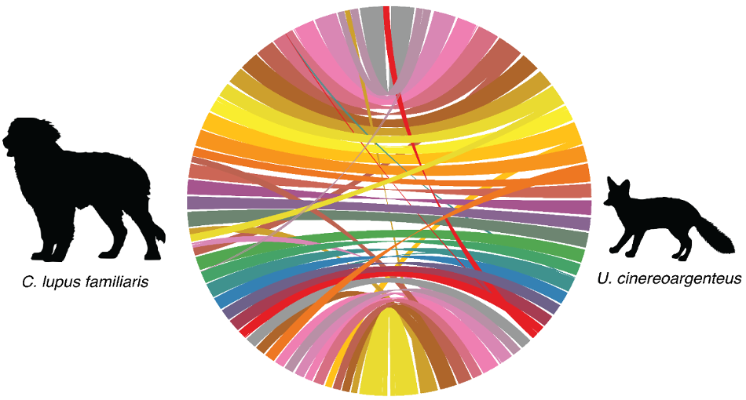
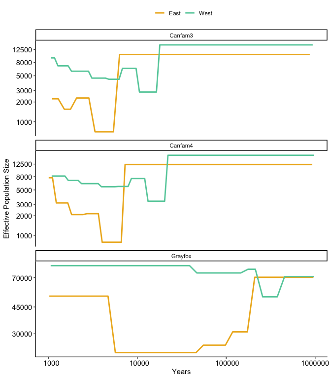

Mainland
================

-   [Samples](#samples)
-   [Reference genome](#reference-genome)
-   [Demographies](#demographies)
-   [Recombination rates](#recombination-rates)

## Samples

Whole genome sequencing of gray fox

Data from
[ncbi.nlm.nih.gov/bioproject/PRJNA966176/](https://www.ncbi.nlm.nih.gov/bioproject/PRJNA966176/)

> Preckler-Quisquater et al. (2023). Can demographic histories explain
> long-term isolation and recent pulses of asymmetric gene flow between
> highly divergent grey fox lineages? Molecular Ecology, 32, 5323–5337.
> <https://doi.org/10.1111/mec.17105>

We analyzed n=26 samples (n=14 from East and n=12 from West)

<!-- -->

Eastern samples outlined in red were dropped (sequencing depth &lt;4.5x)
for analyses sensitive to unequal sample sizes (e.g. site frequency
spectra)

## Reference genome

> Armstrong et al. (2024). Chromosome-level assembly of the gray fox
> (Urocyon cinereoargenteus) confirms the basal loss of PRDM9 in
> Canidae, G3 Genes\|Genomes\|Genetics, 14:4jkae034,
> <https://doi.org/10.1093/g3journal/jkae034>

## Demographies

SMC++ Output

<!-- -->
<table class="table" style="width: auto !important; float: left; margin-right: 10px;">
<thead>
<tr>
<th style="border-bottom:hidden;padding-bottom:0; padding-left:3px;padding-right:3px;text-align: center; " colspan="3">

Canfam4

</th>
</tr>
<tr>
<th style="border-bottom:hidden;padding-bottom:0; padding-left:3px;padding-right:3px;text-align: center; " colspan="3">

East

</th>
</tr>
<tr>
<th style="text-align:right;">
start
</th>
<th style="text-align:right;">
end
</th>
<th style="text-align:right;">
Ne
</th>
</tr>
</thead>
<tbody>
<tr>
<td style="text-align:right;">
7,300
</td>
<td style="text-align:right;">
930,100
</td>
<td style="text-align:right;">
12,300
</td>
</tr>
<tr>
<td style="text-align:right;">
4,000
</td>
<td style="text-align:right;">
6,600
</td>
<td style="text-align:right;">
800
</td>
</tr>
<tr>
<td style="text-align:right;">
2,700
</td>
<td style="text-align:right;">
3,700
</td>
<td style="text-align:right;">
2,200
</td>
</tr>
<tr>
<td style="text-align:right;">
1,800
</td>
<td style="text-align:right;">
2,500
</td>
<td style="text-align:right;">
2,100
</td>
</tr>
<tr>
<td style="text-align:right;">
1,200
</td>
<td style="text-align:right;">
1,700
</td>
<td style="text-align:right;">
3,200
</td>
</tr>
<tr>
<td style="text-align:right;">
1,000
</td>
<td style="text-align:right;">
1,100
</td>
<td style="text-align:right;">
7,700
</td>
</tr>
</tbody>
</table>
<table class="table" style="width: auto !important; float: left; margin-right: 10px;">
<thead>
<tr>
<th style="border-bottom:hidden;padding-bottom:0; padding-left:3px;padding-right:3px;text-align: center; " colspan="3">

Canfam3

</th>
</tr>
<tr>
<th style="border-bottom:hidden;padding-bottom:0; padding-left:3px;padding-right:3px;text-align: center; " colspan="3">

East

</th>
</tr>
<tr>
<th style="text-align:right;">
start
</th>
<th style="text-align:right;">
end
</th>
<th style="text-align:right;">
Ne
</th>
</tr>
</thead>
<tbody>
<tr>
<td style="text-align:right;">
6,300
</td>
<td style="text-align:right;">
870,900
</td>
<td style="text-align:right;">
10,500
</td>
</tr>
<tr>
<td style="text-align:right;">
3,300
</td>
<td style="text-align:right;">
5,400
</td>
<td style="text-align:right;">
700
</td>
</tr>
<tr>
<td style="text-align:right;">
2,100
</td>
<td style="text-align:right;">
2,900
</td>
<td style="text-align:right;">
2,300
</td>
</tr>
<tr>
<td style="text-align:right;">
1,500
</td>
<td style="text-align:right;">
1,800
</td>
<td style="text-align:right;">
1,600
</td>
</tr>
<tr>
<td style="text-align:right;">
1,100
</td>
<td style="text-align:right;">
1,300
</td>
<td style="text-align:right;">
2,200
</td>
</tr>
</tbody>
</table>
<table class="table" style="width: auto !important; ">
<thead>
<tr>
<th style="border-bottom:hidden;padding-bottom:0; padding-left:3px;padding-right:3px;text-align: center; " colspan="3">

Grayfox

</th>
</tr>
<tr>
<th style="border-bottom:hidden;padding-bottom:0; padding-left:3px;padding-right:3px;text-align: center; " colspan="3">

East

</th>
</tr>
<tr>
<th style="text-align:right;">
start
</th>
<th style="text-align:right;">
end
</th>
<th style="text-align:right;">
Ne
</th>
</tr>
</thead>
<tbody>
<tr>
<td style="text-align:right;">
209,400
</td>
<td style="text-align:right;">
957,200
</td>
<td style="text-align:right;">
70,500
</td>
</tr>
<tr>
<td style="text-align:right;">
118,400
</td>
<td style="text-align:right;">
173,200
</td>
<td style="text-align:right;">
30,900
</td>
</tr>
<tr>
<td style="text-align:right;">
55,400
</td>
<td style="text-align:right;">
97,900
</td>
<td style="text-align:right;">
25,300
</td>
</tr>
<tr>
<td style="text-align:right;">
5,700
</td>
<td style="text-align:right;">
45,800
</td>
<td style="text-align:right;">
22,600
</td>
</tr>
<tr>
<td style="text-align:right;">
1,000
</td>
<td style="text-align:right;">
4,700
</td>
<td style="text-align:right;">
53,000
</td>
</tr>
</tbody>
</table>

 

<!-- -->
<table class="table" style="width: auto !important; float: left; margin-right: 10px;">
<thead>
<tr>
<th style="border-bottom:hidden;padding-bottom:0; padding-left:3px;padding-right:3px;text-align: center; " colspan="3">

Canfam4

</th>
</tr>
<tr>
<th style="border-bottom:hidden;padding-bottom:0; padding-left:3px;padding-right:3px;text-align: center; " colspan="3">

West

</th>
</tr>
<tr>
<th style="text-align:right;">
start
</th>
<th style="text-align:right;">
end
</th>
<th style="text-align:right;">
Ne
</th>
</tr>
</thead>
<tbody>
<tr>
<td style="text-align:right;">
22,100
</td>
<td style="text-align:right;">
975,100
</td>
<td style="text-align:right;">
17,100
</td>
</tr>
<tr>
<td style="text-align:right;">
13,200
</td>
<td style="text-align:right;">
20,300
</td>
<td style="text-align:right;">
3,400
</td>
</tr>
<tr>
<td style="text-align:right;">
8,600
</td>
<td style="text-align:right;">
12,100
</td>
<td style="text-align:right;">
7,500
</td>
</tr>
<tr>
<td style="text-align:right;">
6,100
</td>
<td style="text-align:right;">
7,900
</td>
<td style="text-align:right;">
5,700
</td>
</tr>
<tr>
<td style="text-align:right;">
4,000
</td>
<td style="text-align:right;">
5,600
</td>
<td style="text-align:right;">
5,600
</td>
</tr>
<tr>
<td style="text-align:right;">
2,400
</td>
<td style="text-align:right;">
3,600
</td>
<td style="text-align:right;">
6,300
</td>
</tr>
<tr>
<td style="text-align:right;">
1,700
</td>
<td style="text-align:right;">
2,200
</td>
<td style="text-align:right;">
7,000
</td>
</tr>
<tr>
<td style="text-align:right;">
1,100
</td>
<td style="text-align:right;">
1,500
</td>
<td style="text-align:right;">
8,200
</td>
</tr>
</tbody>
</table>
<table class="table" style="width: auto !important; float: left; margin-right: 10px;">
<thead>
<tr>
<th style="border-bottom:hidden;padding-bottom:0; padding-left:3px;padding-right:3px;text-align: center; " colspan="3">

Canfam3

</th>
</tr>
<tr>
<th style="border-bottom:hidden;padding-bottom:0; padding-left:3px;padding-right:3px;text-align: center; " colspan="3">

West

</th>
</tr>
<tr>
<th style="text-align:right;">
start
</th>
<th style="text-align:right;">
end
</th>
<th style="text-align:right;">
Ne
</th>
</tr>
</thead>
<tbody>
<tr>
<td style="text-align:right;">
17,900
</td>
<td style="text-align:right;">
939,800
</td>
<td style="text-align:right;">
14,700
</td>
</tr>
<tr>
<td style="text-align:right;">
10,600
</td>
<td style="text-align:right;">
16,400
</td>
<td style="text-align:right;">
2,800
</td>
</tr>
<tr>
<td style="text-align:right;">
6,800
</td>
<td style="text-align:right;">
9,700
</td>
<td style="text-align:right;">
6,500
</td>
</tr>
<tr>
<td style="text-align:right;">
4,800
</td>
<td style="text-align:right;">
6,200
</td>
<td style="text-align:right;">
4,400
</td>
</tr>
<tr>
<td style="text-align:right;">
3,100
</td>
<td style="text-align:right;">
4,400
</td>
<td style="text-align:right;">
4,600
</td>
</tr>
<tr>
<td style="text-align:right;">
1,800
</td>
<td style="text-align:right;">
2,800
</td>
<td style="text-align:right;">
5,900
</td>
</tr>
<tr>
<td style="text-align:right;">
1,300
</td>
<td style="text-align:right;">
1,700
</td>
<td style="text-align:right;">
7,100
</td>
</tr>
<tr>
<td style="text-align:right;">
1,100
</td>
<td style="text-align:right;">
1,200
</td>
<td style="text-align:right;">
9,400
</td>
</tr>
</tbody>
</table>
<table class="table" style="width: auto !important; ">
<thead>
<tr>
<th style="border-bottom:hidden;padding-bottom:0; padding-left:3px;padding-right:3px;text-align: center; " colspan="3">

Grayfox

</th>
</tr>
<tr>
<th style="border-bottom:hidden;padding-bottom:0; padding-left:3px;padding-right:3px;text-align: center; " colspan="3">

West

</th>
</tr>
<tr>
<th style="text-align:right;">
start
</th>
<th style="text-align:right;">
end
</th>
<th style="text-align:right;">
Ne
</th>
</tr>
</thead>
<tbody>
<tr>
<td style="text-align:right;">
453,700
</td>
<td style="text-align:right;">
967,400
</td>
<td style="text-align:right;">
71,200
</td>
</tr>
<tr>
<td style="text-align:right;">
257,100
</td>
<td style="text-align:right;">
375,400
</td>
<td style="text-align:right;">
52,500
</td>
</tr>
<tr>
<td style="text-align:right;">
176,100
</td>
<td style="text-align:right;">
212,800
</td>
<td style="text-align:right;">
79,600
</td>
</tr>
<tr>
<td style="text-align:right;">
46,800
</td>
<td style="text-align:right;">
145,700
</td>
<td style="text-align:right;">
75,200
</td>
</tr>
<tr>
<td style="text-align:right;">
1,100
</td>
<td style="text-align:right;">
38,700
</td>
<td style="text-align:right;">
84,000
</td>
</tr>
</tbody>
</table>

       

## Recombination rates

Pyrho output

<table>
<thead>
<tr>
<th style="text-align:left;">
genome
</th>
<th style="text-align:left;">
pop
</th>
<th style="text-align:right;">
recomb
</th>
</tr>
</thead>
<tbody>
<tr>
<td style="text-align:left;">
Canfam4
</td>
<td style="text-align:left;">
East
</td>
<td style="text-align:right;">
4.15500e-08
</td>
</tr>
<tr>
<td style="text-align:left;">
Canfam4
</td>
<td style="text-align:left;">
West
</td>
<td style="text-align:right;">
6.63380e-08
</td>
</tr>
<tr>
<td style="text-align:left;">
Canfam3
</td>
<td style="text-align:left;">
East
</td>
<td style="text-align:right;">
5.54520e-08
</td>
</tr>
<tr>
<td style="text-align:left;">
Canfam3
</td>
<td style="text-align:left;">
West
</td>
<td style="text-align:right;">
1.04263e-07
</td>
</tr>
<tr>
<td style="text-align:left;">
Grayfox
</td>
<td style="text-align:left;">
East
</td>
<td style="text-align:right;">
1.34380e-08
</td>
</tr>
<tr>
<td style="text-align:left;">
Grayfox
</td>
<td style="text-align:left;">
West
</td>
<td style="text-align:right;">
2.08490e-08
</td>
</tr>
</tbody>
</table>

<!-- -->
