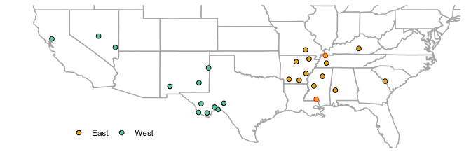
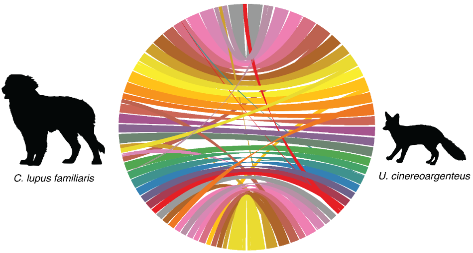
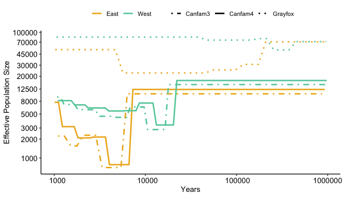
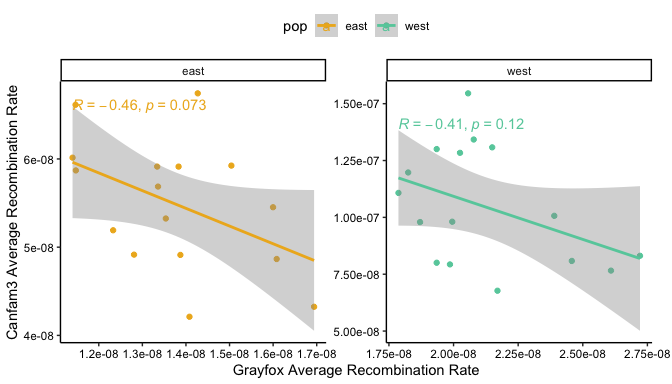

Mainland
================

-   [Samples](#samples)
-   [Reference genome](#reference-genome)
-   [Demographies](#demographies)
-   [Recombination rates](#recombination-rates)

## Samples

Whole genome sequencing of gray fox

Data from
[ncbi.nlm.nih.gov/bioproject/PRJNA966176/](https://www.ncbi.nlm.nih.gov/bioproject/PRJNA966176/)

> Preckler-Quisquater et al. (2023). Can demographic histories explain
> long-term isolation and recent pulses of asymmetric gene flow between
> highly divergent grey fox lineages? Molecular Ecology, 32, 5323–5337.
> <https://doi.org/10.1111/mec.17105>

We analyzed n=26 samples (n=14 from East and n=12 from West)

<!-- -->

Eastern samples outlined in red were dropped (sequencing depth &lt;4.5x)
for analyses sensitive to unequal sample sizes (e.g. site frequency
spectra)

## Reference genome

> Armstrong et al. (2024). Chromosome-level assembly of the gray fox
> (Urocyon cinereoargenteus) confirms the basal loss of PRDM9 in
> Canidae, G3 Genes\|Genomes\|Genetics, 14:4jkae034,
> <https://doi.org/10.1093/g3journal/jkae034>

## Demographies

SMC++ Output

<!-- -->
<table class="kable_wrapper table" style="width: auto !important; margin-left: auto; margin-right: auto;">
<caption>
East
</caption>
<tbody>
<tr>
<td>
<table>
<thead>
<tr>
<th style="text-align:left;">
genome
</th>
<th style="text-align:right;">
start
</th>
<th style="text-align:right;">
end
</th>
<th style="text-align:right;">
Ne
</th>
</tr>
</thead>
<tbody>
<tr>
<td style="text-align:left;">
Canfam4
</td>
<td style="text-align:right;">
7000
</td>
<td style="text-align:right;">
930000
</td>
<td style="text-align:right;">
12000
</td>
</tr>
<tr>
<td style="text-align:left;">
Canfam4
</td>
<td style="text-align:right;">
4000
</td>
<td style="text-align:right;">
7000
</td>
<td style="text-align:right;">
1000
</td>
</tr>
<tr>
<td style="text-align:left;">
Canfam4
</td>
<td style="text-align:right;">
3000
</td>
<td style="text-align:right;">
4000
</td>
<td style="text-align:right;">
2000
</td>
</tr>
<tr>
<td style="text-align:left;">
Canfam4
</td>
<td style="text-align:right;">
2000
</td>
<td style="text-align:right;">
2000
</td>
<td style="text-align:right;">
2000
</td>
</tr>
<tr>
<td style="text-align:left;">
Canfam4
</td>
<td style="text-align:right;">
1000
</td>
<td style="text-align:right;">
2000
</td>
<td style="text-align:right;">
3000
</td>
</tr>
<tr>
<td style="text-align:left;">
Canfam4
</td>
<td style="text-align:right;">
1000
</td>
<td style="text-align:right;">
1000
</td>
<td style="text-align:right;">
8000
</td>
</tr>
</tbody>
</table>
</td>
<td>
<table>
<thead>
<tr>
<th style="text-align:left;">
genome
</th>
<th style="text-align:right;">
start
</th>
<th style="text-align:right;">
end
</th>
<th style="text-align:right;">
Ne
</th>
</tr>
</thead>
<tbody>
<tr>
<td style="text-align:left;">
Canfam3
</td>
<td style="text-align:right;">
6000
</td>
<td style="text-align:right;">
871000
</td>
<td style="text-align:right;">
11000
</td>
</tr>
<tr>
<td style="text-align:left;">
Canfam3
</td>
<td style="text-align:right;">
3000
</td>
<td style="text-align:right;">
5000
</td>
<td style="text-align:right;">
1000
</td>
</tr>
<tr>
<td style="text-align:left;">
Canfam3
</td>
<td style="text-align:right;">
2000
</td>
<td style="text-align:right;">
3000
</td>
<td style="text-align:right;">
2000
</td>
</tr>
<tr>
<td style="text-align:left;">
Canfam3
</td>
<td style="text-align:right;">
2000
</td>
<td style="text-align:right;">
2000
</td>
<td style="text-align:right;">
2000
</td>
</tr>
<tr>
<td style="text-align:left;">
Canfam3
</td>
<td style="text-align:right;">
1000
</td>
<td style="text-align:right;">
1000
</td>
<td style="text-align:right;">
2000
</td>
</tr>
</tbody>
</table>
</td>
<td>
<table>
<thead>
<tr>
<th style="text-align:left;">
genome
</th>
<th style="text-align:right;">
start
</th>
<th style="text-align:right;">
end
</th>
<th style="text-align:right;">
Ne
</th>
</tr>
</thead>
<tbody>
<tr>
<td style="text-align:left;">
Grayfox
</td>
<td style="text-align:right;">
209000
</td>
<td style="text-align:right;">
957000
</td>
<td style="text-align:right;">
71000
</td>
</tr>
<tr>
<td style="text-align:left;">
Grayfox
</td>
<td style="text-align:right;">
118000
</td>
<td style="text-align:right;">
173000
</td>
<td style="text-align:right;">
31000
</td>
</tr>
<tr>
<td style="text-align:left;">
Grayfox
</td>
<td style="text-align:right;">
55000
</td>
<td style="text-align:right;">
98000
</td>
<td style="text-align:right;">
25000
</td>
</tr>
<tr>
<td style="text-align:left;">
Grayfox
</td>
<td style="text-align:right;">
6000
</td>
<td style="text-align:right;">
46000
</td>
<td style="text-align:right;">
23000
</td>
</tr>
<tr>
<td style="text-align:left;">
Grayfox
</td>
<td style="text-align:right;">
1000
</td>
<td style="text-align:right;">
5000
</td>
<td style="text-align:right;">
53000
</td>
</tr>
</tbody>
</table>
</td>
</tr>
</tbody>
</table>
<table class="kable_wrapper table" style="width: auto !important; margin-left: auto; margin-right: auto;">
<caption>
West
</caption>
<tbody>
<tr>
<td>
<table>
<thead>
<tr>
<th style="text-align:left;">
genome
</th>
<th style="text-align:right;">
start
</th>
<th style="text-align:right;">
end
</th>
<th style="text-align:right;">
Ne
</th>
</tr>
</thead>
<tbody>
<tr>
<td style="text-align:left;">
Canfam4
</td>
<td style="text-align:right;">
22000
</td>
<td style="text-align:right;">
975000
</td>
<td style="text-align:right;">
17000
</td>
</tr>
<tr>
<td style="text-align:left;">
Canfam4
</td>
<td style="text-align:right;">
13000
</td>
<td style="text-align:right;">
20000
</td>
<td style="text-align:right;">
3000
</td>
</tr>
<tr>
<td style="text-align:left;">
Canfam4
</td>
<td style="text-align:right;">
9000
</td>
<td style="text-align:right;">
12000
</td>
<td style="text-align:right;">
7000
</td>
</tr>
<tr>
<td style="text-align:left;">
Canfam4
</td>
<td style="text-align:right;">
6000
</td>
<td style="text-align:right;">
8000
</td>
<td style="text-align:right;">
6000
</td>
</tr>
<tr>
<td style="text-align:left;">
Canfam4
</td>
<td style="text-align:right;">
4000
</td>
<td style="text-align:right;">
6000
</td>
<td style="text-align:right;">
6000
</td>
</tr>
<tr>
<td style="text-align:left;">
Canfam4
</td>
<td style="text-align:right;">
2000
</td>
<td style="text-align:right;">
4000
</td>
<td style="text-align:right;">
6000
</td>
</tr>
<tr>
<td style="text-align:left;">
Canfam4
</td>
<td style="text-align:right;">
2000
</td>
<td style="text-align:right;">
2000
</td>
<td style="text-align:right;">
7000
</td>
</tr>
<tr>
<td style="text-align:left;">
Canfam4
</td>
<td style="text-align:right;">
1000
</td>
<td style="text-align:right;">
2000
</td>
<td style="text-align:right;">
8000
</td>
</tr>
</tbody>
</table>
</td>
<td>
<table>
<thead>
<tr>
<th style="text-align:left;">
genome
</th>
<th style="text-align:right;">
start
</th>
<th style="text-align:right;">
end
</th>
<th style="text-align:right;">
Ne
</th>
</tr>
</thead>
<tbody>
<tr>
<td style="text-align:left;">
Canfam3
</td>
<td style="text-align:right;">
18000
</td>
<td style="text-align:right;">
940000
</td>
<td style="text-align:right;">
15000
</td>
</tr>
<tr>
<td style="text-align:left;">
Canfam3
</td>
<td style="text-align:right;">
11000
</td>
<td style="text-align:right;">
16000
</td>
<td style="text-align:right;">
3000
</td>
</tr>
<tr>
<td style="text-align:left;">
Canfam3
</td>
<td style="text-align:right;">
7000
</td>
<td style="text-align:right;">
10000
</td>
<td style="text-align:right;">
6000
</td>
</tr>
<tr>
<td style="text-align:left;">
Canfam3
</td>
<td style="text-align:right;">
5000
</td>
<td style="text-align:right;">
6000
</td>
<td style="text-align:right;">
4000
</td>
</tr>
<tr>
<td style="text-align:left;">
Canfam3
</td>
<td style="text-align:right;">
3000
</td>
<td style="text-align:right;">
4000
</td>
<td style="text-align:right;">
5000
</td>
</tr>
<tr>
<td style="text-align:left;">
Canfam3
</td>
<td style="text-align:right;">
2000
</td>
<td style="text-align:right;">
3000
</td>
<td style="text-align:right;">
6000
</td>
</tr>
<tr>
<td style="text-align:left;">
Canfam3
</td>
<td style="text-align:right;">
1000
</td>
<td style="text-align:right;">
2000
</td>
<td style="text-align:right;">
7000
</td>
</tr>
<tr>
<td style="text-align:left;">
Canfam3
</td>
<td style="text-align:right;">
1000
</td>
<td style="text-align:right;">
1000
</td>
<td style="text-align:right;">
9000
</td>
</tr>
</tbody>
</table>
</td>
<td>
<table>
<thead>
<tr>
<th style="text-align:left;">
genome
</th>
<th style="text-align:right;">
start
</th>
<th style="text-align:right;">
end
</th>
<th style="text-align:right;">
Ne
</th>
</tr>
</thead>
<tbody>
<tr>
<td style="text-align:left;">
Grayfox
</td>
<td style="text-align:right;">
454000
</td>
<td style="text-align:right;">
967000
</td>
<td style="text-align:right;">
71000
</td>
</tr>
<tr>
<td style="text-align:left;">
Grayfox
</td>
<td style="text-align:right;">
257000
</td>
<td style="text-align:right;">
375000
</td>
<td style="text-align:right;">
52000
</td>
</tr>
<tr>
<td style="text-align:left;">
Grayfox
</td>
<td style="text-align:right;">
176000
</td>
<td style="text-align:right;">
213000
</td>
<td style="text-align:right;">
80000
</td>
</tr>
<tr>
<td style="text-align:left;">
Grayfox
</td>
<td style="text-align:right;">
47000
</td>
<td style="text-align:right;">
146000
</td>
<td style="text-align:right;">
75000
</td>
</tr>
<tr>
<td style="text-align:left;">
Grayfox
</td>
<td style="text-align:right;">
1000
</td>
<td style="text-align:right;">
39000
</td>
<td style="text-align:right;">
84000
</td>
</tr>
</tbody>
</table>
</td>
</tr>
</tbody>
</table>

## Recombination rates

Pyrho output

<table>
<thead>
<tr>
<th style="text-align:left;">
genome
</th>
<th style="text-align:left;">
pop
</th>
<th style="text-align:right;">
recomb
</th>
</tr>
</thead>
<tbody>
<tr>
<td style="text-align:left;">
Canfam4
</td>
<td style="text-align:left;">
East
</td>
<td style="text-align:right;">
4.15500e-08
</td>
</tr>
<tr>
<td style="text-align:left;">
Canfam4
</td>
<td style="text-align:left;">
West
</td>
<td style="text-align:right;">
6.63380e-08
</td>
</tr>
<tr>
<td style="text-align:left;">
Canfam3
</td>
<td style="text-align:left;">
East
</td>
<td style="text-align:right;">
5.54520e-08
</td>
</tr>
<tr>
<td style="text-align:left;">
Canfam3
</td>
<td style="text-align:left;">
West
</td>
<td style="text-align:right;">
1.04263e-07
</td>
</tr>
<tr>
<td style="text-align:left;">
Grayfox
</td>
<td style="text-align:left;">
East
</td>
<td style="text-align:right;">
1.34380e-08
</td>
</tr>
<tr>
<td style="text-align:left;">
Grayfox
</td>
<td style="text-align:left;">
West
</td>
<td style="text-align:right;">
2.08490e-08
</td>
</tr>
</tbody>
</table>

<!-- -->
