```{r setup, include=FALSE, warning=FALSE, message=FALSE}
knitr::opts_chunk$set(echo = TRUE)
library(tidyverse)
library(knitr)
library(rmarkdown)
library(usmap)
library(data.table)
library(scales)
library(janitor)
library(kableExtra)
```


## Samples 
```{r Samples, echo=FALSE, fig.height=5, fig.width=5.5, message=FALSE, warning=FALSE}

usa <- map_data("state")

east6emp <- c("SRR24465306","SRR24465269","SRR24465307","SRR24465297","SRR24465272","SRR24465305")

east6dem <- c("SRR24465268","SRR24465309","SRR24465270","SRR24465308","SRR24465271","SRR24465304")


pop <- read_tsv("Mainland_files/input/mainland_WGSmetadata.txt") %>% 
  dplyr::rename("long"=Lon,"lat"=Lat) %>% 
  filter(Dataset=="Sacks") %>% 
  filter(`Depth(x)`>4.5) %>% 
  filter(Deme=="pure")   %>% 
  mutate(Subset=case_when(SRA %in% east6emp ~ "Empirical",
                          SRA %in% east6dem ~ "Priors",
                          TRUE ~ "REST")) %>% filter(!Subset=="REST")


ggplot() +
  geom_polygon(data = usa, aes(x=long, y = lat, group = group), 
               fill = "cornsilk", color="gray70", linewidth=0.3) + 
  geom_point(data=pop, aes(x=long, y = lat,fill=Subset),size=2, stroke=0.5,shape=21) +
  coord_fixed(xlim = c(-95, -72),  ylim = c(26, 45)) +
  geom_point(aes(x=-72.20392,y=44.14799),shape=23,size=2,stroke=0.5,fill="royalblue")+
  geom_text(aes(x=-73.5,y=45.5,label="Reference"),size=3.5, color="royalblue",fontface="bold")+
  scale_fill_manual(values = c("black", "red"))+
  xlab("") + ylab("") +
  theme(panel.grid.minor=element_blank(),
        panel.grid.major = element_blank(),
        legend.position = c(0.85,0.15),
        legend.key = element_rect(colour = NA, fill = NA),
        legend.spacing.y = unit(-0.1, "cm"),
        legend.title = element_blank(),
        axis.line=element_line(color="black",linewidth = 0.5),
        axis.text=element_text(color="black"),
        #axis.ticks=element_blank(),
        panel.background=element_rect(color="white",fill="azure",linewidth = 0.5)) 
```


## Priors

### SMC++ output
```{r Priors, echo=FALSE, fig.height=5,fig.width=7, message=FALSE, warning=FALSE}

cf3_e6 <- read_csv("ABC_files/plot_cf3_east6.csv")%>% filter(x>1e3 & x<1e6) 

gf_e6 <- read_csv("ABC_files/plot_east_mask.csv")%>% filter(x>1e3 & x<1e6) 

e6 <- bind_rows("canfam3"=cf3_e6,"grayfox"=gf_e6,.id = "genome") 

zx_breaks = c(1e3, 1e4, 1e5, 1e6)
zy_breaks = c(700,2e3,5e3,1e4,15e3,2e4,3e4,5e4,8e4)

ggplot()+
  geom_line(data=e6,aes(x=x,y=y,color=genome),size=2) + 
  scale_y_continuous(trans = "log",breaks=zy_breaks,labels = scales::comma)+  
  scale_x_continuous(trans = "log",breaks=zx_breaks,labels = scales::comma)+ 
  labs(x ="Generations", y = "Effective Population Size") +
  theme_classic() +
  theme(axis.text=element_text(color="black", size=11),
        legend.position = c(0.9,0.2)) +
  scale_color_manual(values = c("green3","purple"))

cf3_e6_roundpb <- cf3_e6 %>% 
  dplyr::group_by(y) %>% 
  dplyr::rename("Ne"="y") %>% 
  dplyr::summarise(time_st=as.integer(min(x)),time_end=as.integer(max(x))) %>% 
  mutate(Ne=as.integer(Ne)) %>% 
  arrange(desc(time_st)) 

gf_e6_roundpb <- gf_e6 %>% 
  dplyr::group_by(y) %>% 
  dplyr::rename("Ne"="y") %>% 
  dplyr::summarise(time_st=as.integer(min(x)),time_end=as.integer(max(x))) %>% 
  mutate(Ne=as.integer(Ne)) %>% 
  arrange(desc(time_st)) 

roundpb <- cbind(gf_e6_roundpb,cf3_e6_roundpb) %>% unname()

kable(roundpb, "html", escape = FALSE,format.args = list(big.mark = ",") ) %>% 
  kable_styling(full_width = F) %>%
  add_header_above(c("Ne" = 1, "start" = 1,"end" = 1,"Ne" = 1, "start" = 1,"end" = 1)) %>% 
  add_header_above(c("Grayfox" = 3, "Canfam3" = 3))
```


### Distributions for Sampling
```{r DemParam, echo=FALSE, fig.height=4, message=FALSE, warning=FALSE}

priors <- read_tsv("ABC_files/ref_priors.txt") 

priors$var <- factor(priors$var , levels = c("NeThree","TimeTwo","NeTwo","TimeOne","NeCurr"))

priors <- priors[order(priors$var), ]

kable(priors, "html", escape = FALSE,col.names = NULL,format.args = list(big.mark = ",") ) %>% 
  kable_styling(full_width = F) %>%
  add_header_above(c("Variable" = 1, "Min" = 1,"Max" = 1,"Min" = 1,"Max" = 1)) %>%
  add_header_above(c(" "=1, "Grayfox" = 2, "Canfam3" = 2))

cx_breaks = c(1e3, 4e3, 2e4,1e5, 1e6)
cy_breaks = c(700,15e2,3e3,5e3,1e4,15e3)


ggplot()+
  geom_rect(aes(xmin=1e3, xmax=4e3, ymin=0, ymax=15e3), fill="gray80",color=NA, alpha=0.5)+
  geom_rect(aes(xmin=4e3, xmax=2e4, ymin=0, ymax=15e3), fill="gray90",color=NA, alpha=0.5)+
  geom_line(data=subset(cf3_e6,x<2e5),aes(x=x,y=y),color="green3",size=2) + 
  scale_y_continuous(trans = "log",breaks=cy_breaks,labels = scales::comma)+  
  scale_x_continuous(trans = "log",breaks=cx_breaks,labels = scales::comma)+ 
  labs(x ="Generations", y = "Effective Population Size") +
  theme_classic() +
  theme(axis.text=element_text(color="black", size=11),
        legend.position = c(0.9,0.2)) +
  geom_label(aes( x=1.3e3, y=17e3, label = "750 - 5,000"), color = "green3")+
  geom_label(aes( x=4.3e3, y=17e3, label = "150 - 1,500"), color = "green3")+
  geom_label(aes( x=1.8e4, y=17e3, label = "5,000 - 20,000"), color = "green3")+
  ggtitle("Canfam3")


gx_breaks = c(1e3, 7.5e3, 5e4,125e3, 1e6)
gy_breaks = c(700,2e3,5e3,1e4,15e3,2e4,3e4,5e4,8e4)


ggplot()+
  geom_rect(aes(xmin=1e3, xmax=7.5e3, ymin=0, ymax=8e4), fill="gray80",color=NA, alpha=0.5)+
  geom_rect(aes(xmin=75e3, xmax=125e3, ymin=0, ymax=8e4), fill="gray90",color=NA, alpha=0.5)+
  geom_line(data=subset(gf_e6,x<5e5),aes(x=x,y=y),color="purple",size=2) + 
  scale_y_continuous(trans = "log",breaks=gy_breaks,labels = scales::comma)+  
  scale_x_continuous(trans = "log",breaks=gx_breaks,labels = scales::comma)+ 
  labs(x ="Generations", y = "Effective Population Size") +
  theme_classic() +
  theme(axis.text=element_text(color="black", size=11)) +
  geom_label(aes( x=2.2e3, y=8.5e4, label = "40,000 - 70,000"), color = "purple")+
  geom_label(aes( x=1.5e4, y=8.5e4, label = "10,000 - 50,000"), color = "purple")+
  geom_label(aes( x=75e3, y=8.5e4, label = "60,000 - 90,000"), color = "purple")+
  ggtitle("Grayfox")
  


##bin pi 
eastint <- read_tsv("~/Downloads/neut_pi_reg_cf3_e6.bed",
                    col_names = c("chr","start","end","chrom","x","y","pi"))

counteast <- eastint %>% 
  mutate(pie=case_when(is.na(pi) ~ 0, TRUE ~ pi)) %>% 
  group_by(chr,start,end) %>% 
  summarise(n=n(), sumpi=sum(pie)) %>% 
  mutate(size=end-start, avgpi=sumpi/size) %>% 
  mutate(cutsize=cut(avgpi,c(-Inf,0.00004,0.00008,0.00016,0.00024,0.00032,Inf),
                     labels = c("nd_1","nd_2","nd_3","nd_4","nd_5","nd_6")))

cte <- counteast %>% group_by(cutsize) %>% summarise(regs=n())
```

## Summary Statistics


```{r empBin, echo=FALSE, fig.height=5.5, fig.width=7, message=FALSE, warning=FALSE}


gfempbin<-fread("ABC_files/emp_bin_summary.txt") %>% filter(pop=="east")

cf3empbin<-fread("ABC_files/cf3_emp_bin.txt")

empbin<-bind_rows("Grayfox"=gfempbin, "Canfam3"=cf3empbin, .id="genome")

ggplot(empbin)+
  geom_col(aes(x=bin,y=count,fill=genome))+
  facet_wrap(~stat+genome,scales="free")+
  scale_fill_manual(values = c("green3","purple")) +
  theme_classic()+
  theme(
    panel.grid.minor=element_blank(),
    panel.grid.major=element_blank(),
    panel.background=element_blank(),
    strip.background = element_blank(),
    axis.text = element_text(colour = "black", size = 10),
    axis.line = element_line(colour = "black", linewidth = 0.5),
    axis.ticks = element_line(colour = "black", linewidth = 0.5),
    axis.title = element_blank(),
    legend.position = "none")+  
  scale_y_continuous(labels = ~ format(.x, scientific = FALSE))+
  scale_x_continuous(breaks = seq(1, 6, by = 1))

```

## Grayfox Results  


### Posterior distributions  

All 100,000 Simulations (orange) and Top 100 (blue)

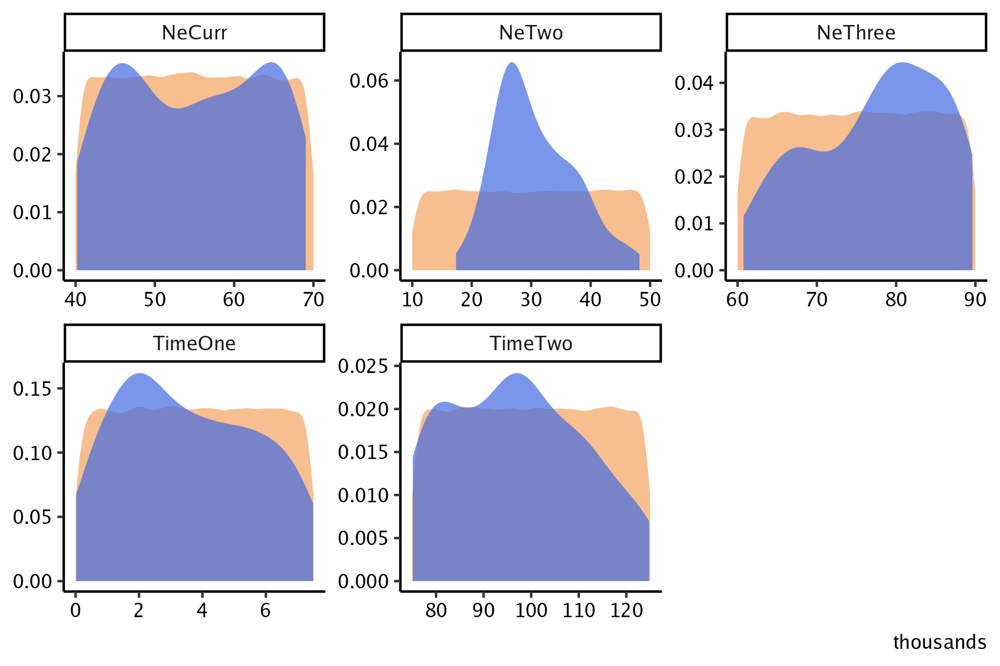


### Bin correlations  

Correlaton between SFS  (x-axis) pi (y-axis) bins (facets)

Gray (all sims), Blue (top 100 sims), Red (empirical) 

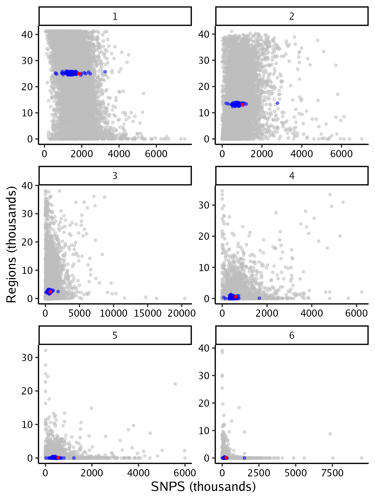


### Bin distributions  


All 100,000 Simulations (orange) and Top 100 (blue)


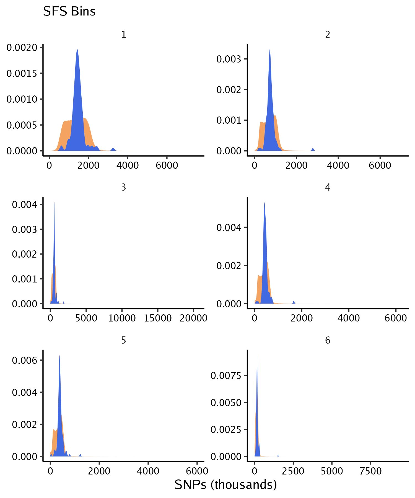


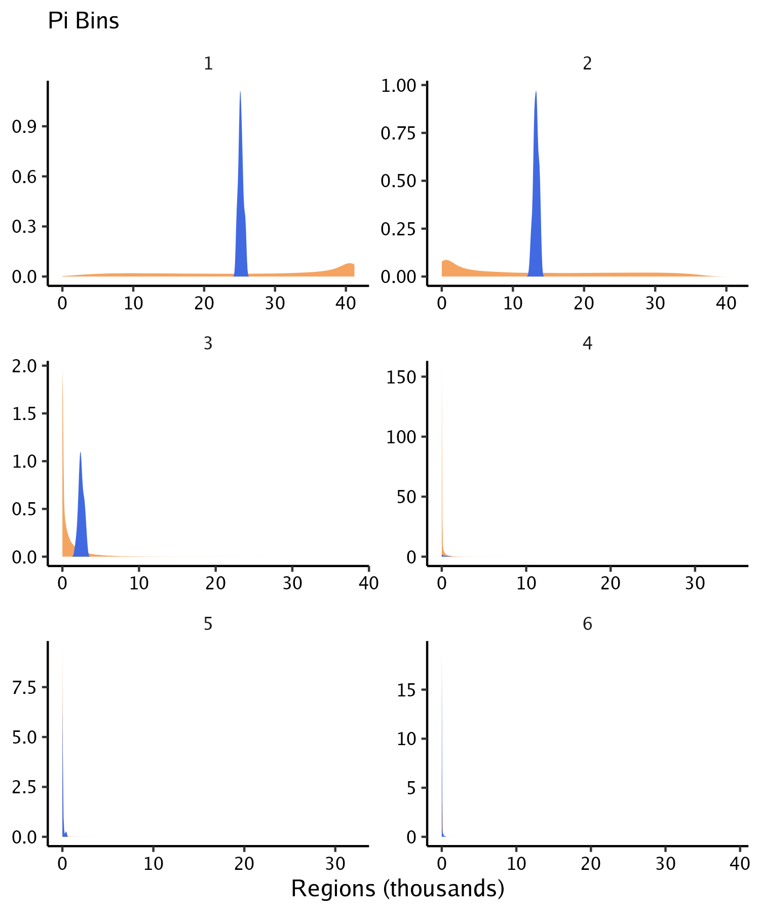


### Top bins  

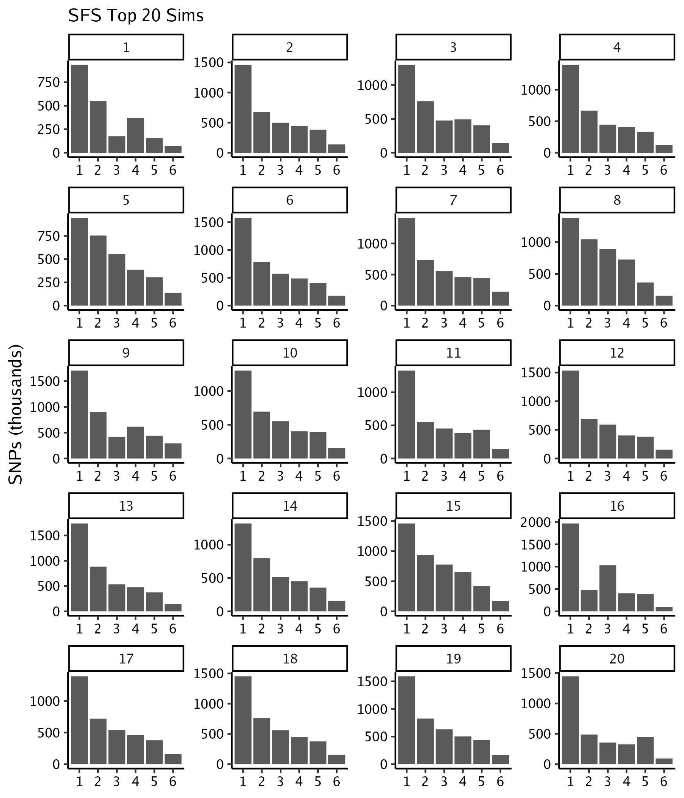


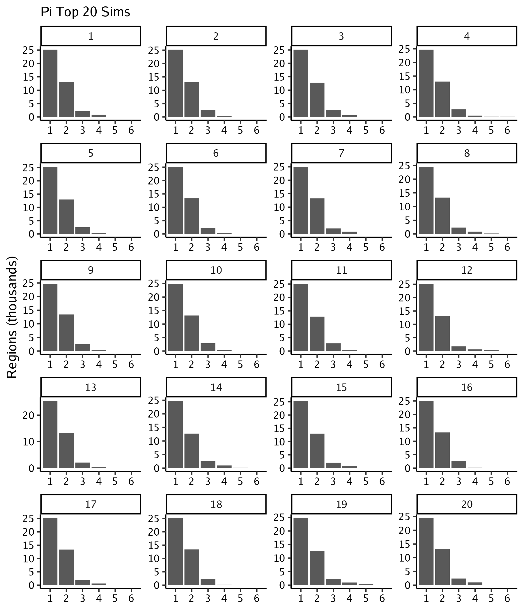


## Canfam3 Results  


### Posterior distributions  

All 100,000 Simulations (orange) and Top 100 (blue)

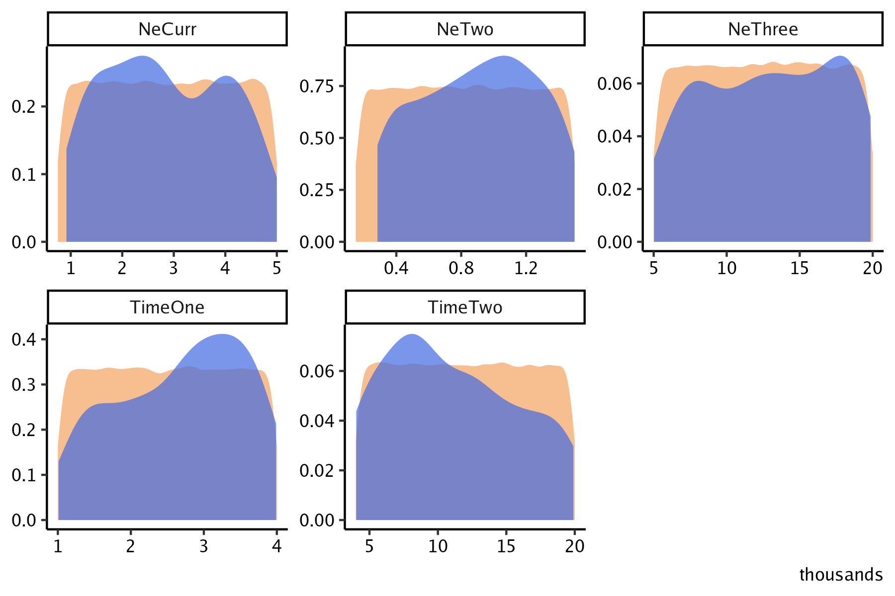


### Bin correlations  

Correlaton between SFS  (x-axis) pi (y-axis) bins (facets)

Gray (all sims), Blue (top 100 sims), Red (empirical) 

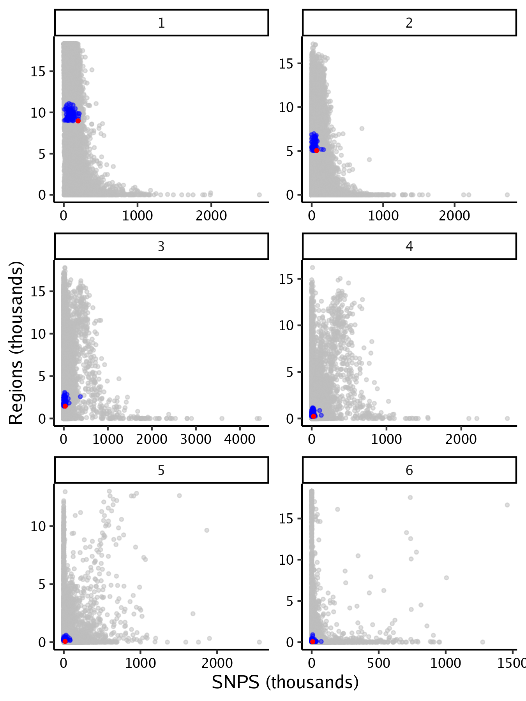


### Bin distributions  


All 100,000 Simulations (orange) and Top 100 (blue)


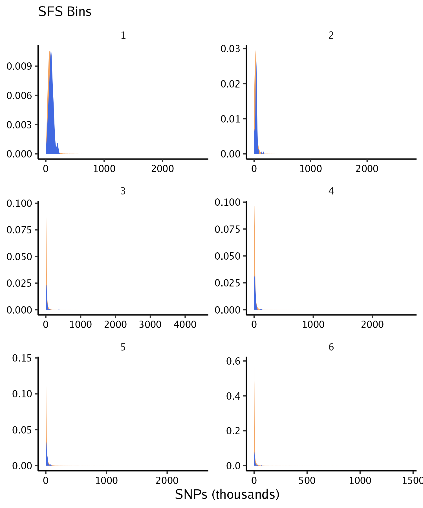


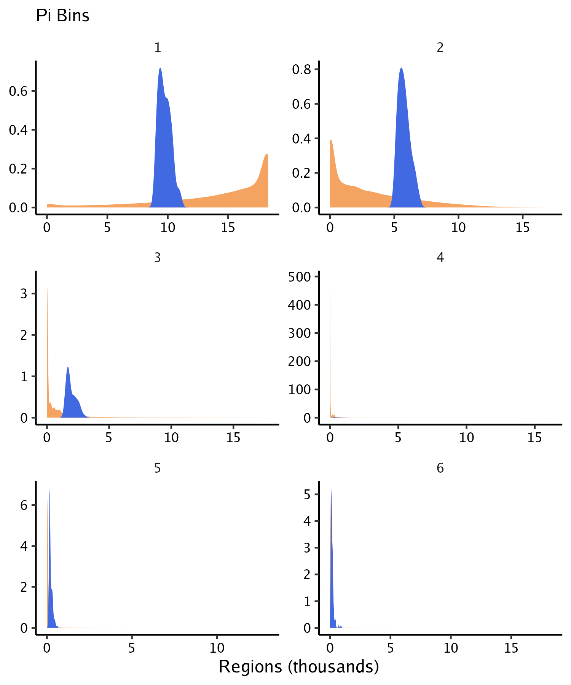


### Top bins  

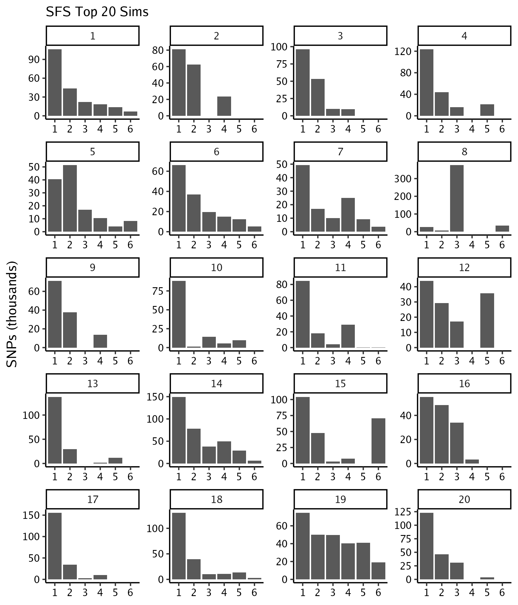


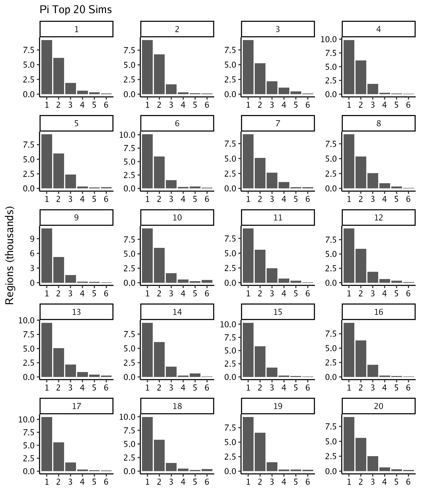


### Results Table
```{r Results, echo=FALSE, fig.height=4, message=FALSE, warning=FALSE}

priors <- read_tsv("ABC_files/ref_priors.txt") 

priors$var <- factor(priors$var , levels = c("NeThree","TimeTwo","NeTwo","TimeOne","NeCurr"))

priors <- priors[order(priors$var), ]


postcicf3 <- read_tsv("ABC_files/cf3_e6_postCI.txt",skip = 1,col_names = c("param","cf3_mode","cf3_ci_lo","cf3_ci_up")) 
postcigf <- read_tsv("ABC_files/gf_e6_postCI.txt",skip = 1,col_names = c("param","gf_mode","gf_ci_lo","gf_ci_up")) 

postci <- left_join(postcicf3,postcigf,by="param")

pripost <- priors %>% left_join(postci,by=c("var"="param")) 

pripostgf<- pripost %>% select(var,st_gf,end_gf,gf_mode,gf_ci_lo,gf_ci_up)%>% 
  mutate(gf_mode=as.integer(gf_mode),gf_ci_lo=as.integer(gf_ci_lo),gf_ci_up=as.integer(gf_ci_up))

pripostcf3<- pripost %>% select(var,st_cf3,end_cf3,cf3_mode,cf3_ci_lo,cf3_ci_up) %>% 
  mutate(cf3_mode=as.integer(cf3_mode),cf3_ci_lo=as.integer(cf3_ci_lo),cf3_ci_up=as.integer(cf3_ci_up))


kable(pripostgf, "html", escape = FALSE,col.names = NULL,format.args = list(big.mark = ",") ) %>% 
  kable_styling(full_width = F) %>%
  add_header_above(c("Variable" = 1, "Min" = 1,"Max" = 1,"Mode" = 1,"CI lo" = 1,"CI up" = 1)) %>%
  add_header_above(c(" "=1, "Priors" = 2, "Results" = 3))%>%
  add_header_above(c("Grayfox"=6))


kable(pripostcf3, "html", escape = FALSE,col.names = NULL,format.args = list(big.mark = ",") ) %>% 
  kable_styling(full_width = F) %>%
  add_header_above(c("Variable" = 1, "Min" = 1,"Max" = 1,"Mode" = 1,"CI lo" = 1,"CI up" = 1)) %>%
  add_header_above(c(" "=1, "Priors" = 2, "Results" = 3))%>%
  add_header_above(c("Canfam3"=6))


```
