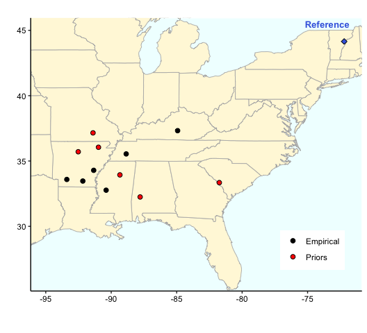
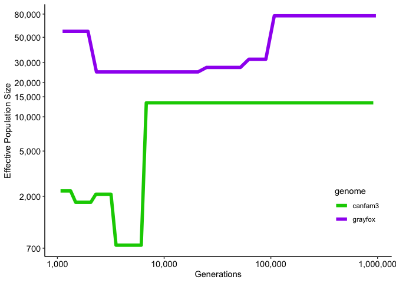
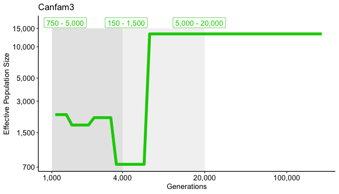
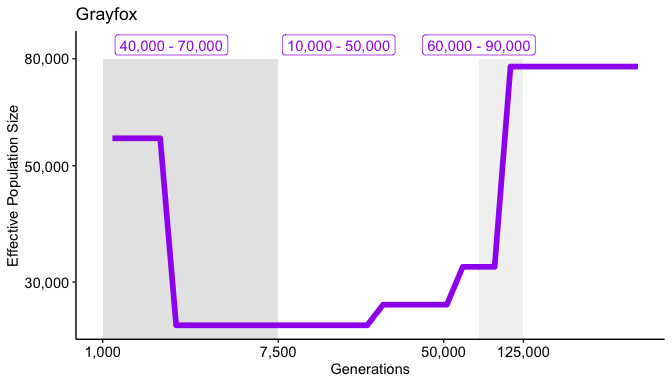
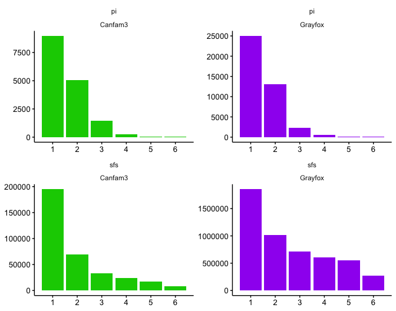

Ref Bias ABC
================

-   [Samples](#samples)
-   [Priors](#priors)
    -   [SMC++ output](#smc-output)
    -   [Distributions for Sampling](#distributions-for-sampling)
-   [Summary Statistics](#summary-statistics)
-   [Grayfox Results](#grayfox-results)
    -   [Posterior distributions](#posterior-distributions)
    -   [Bin correlations](#bin-correlations)
    -   [Bin distributions](#bin-distributions)
    -   [Top bins](#top-bins)
-   [Canfam3 Results](#canfam3-results)
    -   [Posterior distributions](#posterior-distributions-1)
    -   [Bin correlations](#bin-correlations-1)
    -   [Bin distributions](#bin-distributions-1)
    -   [Top bins](#top-bins-1)
    -   [Results Table](#results-table)

## Samples

<!-- -->

## Priors

### SMC++ output

<!-- -->
<table class="table" style="width: auto !important; margin-left: auto; margin-right: auto;">
<thead>
<tr>
<th style="border-bottom:hidden;padding-bottom:0; padding-left:3px;padding-right:3px;text-align: center; " colspan="3">

Grayfox

</th>
<th style="border-bottom:hidden;padding-bottom:0; padding-left:3px;padding-right:3px;text-align: center; " colspan="3">

Canfam3

</th>
</tr>
<tr>
<th style="border-bottom:hidden;padding-bottom:0; padding-left:3px;padding-right:3px;text-align: center; " colspan="1">

Ne

</th>
<th style="border-bottom:hidden;padding-bottom:0; padding-left:3px;padding-right:3px;text-align: center; " colspan="1">

start

</th>
<th style="border-bottom:hidden;padding-bottom:0; padding-left:3px;padding-right:3px;text-align: center; " colspan="1">

end

</th>
<th style="border-bottom:hidden;padding-bottom:0; padding-left:3px;padding-right:3px;text-align: center; " colspan="1">

Ne

</th>
<th style="border-bottom:hidden;padding-bottom:0; padding-left:3px;padding-right:3px;text-align: center; " colspan="1">

start

</th>
<th style="border-bottom:hidden;padding-bottom:0; padding-left:3px;padding-right:3px;text-align: center; " colspan="1">

end

</th>
</tr>
</thead>
<tbody>
<tr>
<td style="text-align:right;">
77,292
</td>
<td style="text-align:right;">
107,731
</td>
<td style="text-align:right;">
965,385
</td>
<td style="text-align:right;">
13,273
</td>
<td style="text-align:right;">
6,805
</td>
<td style="text-align:right;">
912,116
</td>
</tr>
<tr>
<td style="text-align:right;">
32,078
</td>
<td style="text-align:right;">
62,266
</td>
<td style="text-align:right;">
89,738
</td>
<td style="text-align:right;">
744
</td>
<td style="text-align:right;">
3,542
</td>
<td style="text-align:right;">
6,103
</td>
</tr>
<tr>
<td style="text-align:right;">
27,164
</td>
<td style="text-align:right;">
24,970
</td>
<td style="text-align:right;">
51,866
</td>
<td style="text-align:right;">
2,086
</td>
<td style="text-align:right;">
2,291
</td>
<td style="text-align:right;">
3,176
</td>
</tr>
<tr>
<td style="text-align:right;">
24,815
</td>
<td style="text-align:right;">
2,321
</td>
<td style="text-align:right;">
20,800
</td>
<td style="text-align:right;">
1,772
</td>
<td style="text-align:right;">
1,482
</td>
<td style="text-align:right;">
2,055
</td>
</tr>
<tr>
<td style="text-align:right;">
56,412
</td>
<td style="text-align:right;">
1,117
</td>
<td style="text-align:right;">
1,933
</td>
<td style="text-align:right;">
2,231
</td>
<td style="text-align:right;">
1,069
</td>
<td style="text-align:right;">
1,329
</td>
</tr>
</tbody>
</table>

### Distributions for Sampling

<table class="table" style="width: auto !important; margin-left: auto; margin-right: auto;">
<thead>
<tr>
<th style="empty-cells: hide;border-bottom:hidden;" colspan="1">
</th>
<th style="border-bottom:hidden;padding-bottom:0; padding-left:3px;padding-right:3px;text-align: center; " colspan="2">

Grayfox

</th>
<th style="border-bottom:hidden;padding-bottom:0; padding-left:3px;padding-right:3px;text-align: center; " colspan="2">

Canfam3

</th>
</tr>
<tr>
<th style="border-bottom:hidden;padding-bottom:0; padding-left:3px;padding-right:3px;text-align: center; " colspan="1">

Variable

</th>
<th style="border-bottom:hidden;padding-bottom:0; padding-left:3px;padding-right:3px;text-align: center; " colspan="1">

Min

</th>
<th style="border-bottom:hidden;padding-bottom:0; padding-left:3px;padding-right:3px;text-align: center; " colspan="1">

Max

</th>
<th style="border-bottom:hidden;padding-bottom:0; padding-left:3px;padding-right:3px;text-align: center; " colspan="1">

Min

</th>
<th style="border-bottom:hidden;padding-bottom:0; padding-left:3px;padding-right:3px;text-align: center; " colspan="1">

Max

</th>
</tr>
</thead>
<tbody>
<tr>
<td style="text-align:left;">
NeThree
</td>
<td style="text-align:right;">
60,000
</td>
<td style="text-align:right;">
90,000
</td>
<td style="text-align:right;">
5,000
</td>
<td style="text-align:right;">
20,000
</td>
</tr>
<tr>
<td style="text-align:left;">
TimeTwo
</td>
<td style="text-align:right;">
75,000
</td>
<td style="text-align:right;">
125,000
</td>
<td style="text-align:right;">
4,000
</td>
<td style="text-align:right;">
20,000
</td>
</tr>
<tr>
<td style="text-align:left;">
NeTwo
</td>
<td style="text-align:right;">
10,000
</td>
<td style="text-align:right;">
50,000
</td>
<td style="text-align:right;">
150
</td>
<td style="text-align:right;">
1,500
</td>
</tr>
<tr>
<td style="text-align:left;">
TimeOne
</td>
<td style="text-align:right;">
1
</td>
<td style="text-align:right;">
7,500
</td>
<td style="text-align:right;">
1,000
</td>
<td style="text-align:right;">
4,000
</td>
</tr>
<tr>
<td style="text-align:left;">
NeCurr
</td>
<td style="text-align:right;">
40,000
</td>
<td style="text-align:right;">
70,000
</td>
<td style="text-align:right;">
750
</td>
<td style="text-align:right;">
5,000
</td>
</tr>
</tbody>
</table>

<!-- --><!-- -->

## Summary Statistics

<!-- -->

## Grayfox Results

### Posterior distributions

All 100,000 Simulations (orange) and Top 100 (blue)

### Bin correlations

Correlaton between SFS (x-axis) pi (y-axis) bins (facets)

Gray (all sims), Blue (top 100 sims), Red (empirical)

### Bin distributions

All 100,000 Simulations (orange) and Top 100 (blue)

### Top bins

## Canfam3 Results

### Posterior distributions

All 100,000 Simulations (orange) and Top 100 (blue)

### Bin correlations

Correlaton between SFS (x-axis) pi (y-axis) bins (facets)

Gray (all sims), Blue (top 100 sims), Red (empirical)

### Bin distributions

All 100,000 Simulations (orange) and Top 100 (blue)

### Top bins

### Results Table

<table class="table" style="width: auto !important; margin-left: auto; margin-right: auto;">
<thead>
<tr>
<th style="border-bottom:hidden;padding-bottom:0; padding-left:3px;padding-right:3px;text-align: center; " colspan="6">

Grayfox

</th>
</tr>
<tr>
<th style="empty-cells: hide;border-bottom:hidden;" colspan="1">
</th>
<th style="border-bottom:hidden;padding-bottom:0; padding-left:3px;padding-right:3px;text-align: center; " colspan="2">

Priors

</th>
<th style="border-bottom:hidden;padding-bottom:0; padding-left:3px;padding-right:3px;text-align: center; " colspan="3">

Results

</th>
</tr>
<tr>
<th style="border-bottom:hidden;padding-bottom:0; padding-left:3px;padding-right:3px;text-align: center; " colspan="1">

Variable

</th>
<th style="border-bottom:hidden;padding-bottom:0; padding-left:3px;padding-right:3px;text-align: center; " colspan="1">

Min

</th>
<th style="border-bottom:hidden;padding-bottom:0; padding-left:3px;padding-right:3px;text-align: center; " colspan="1">

Max

</th>
<th style="border-bottom:hidden;padding-bottom:0; padding-left:3px;padding-right:3px;text-align: center; " colspan="1">

Mode

</th>
<th style="border-bottom:hidden;padding-bottom:0; padding-left:3px;padding-right:3px;text-align: center; " colspan="1">

CI lo

</th>
<th style="border-bottom:hidden;padding-bottom:0; padding-left:3px;padding-right:3px;text-align: center; " colspan="1">

CI up

</th>
</tr>
</thead>
<tbody>
<tr>
<td style="text-align:left;">
NeThree
</td>
<td style="text-align:right;">
60,000
</td>
<td style="text-align:right;">
90,000
</td>
<td style="text-align:right;">
80,781
</td>
<td style="text-align:right;">
63,057
</td>
<td style="text-align:right;">
90,584
</td>
</tr>
<tr>
<td style="text-align:left;">
TimeTwo
</td>
<td style="text-align:right;">
75,000
</td>
<td style="text-align:right;">
125,000
</td>
<td style="text-align:right;">
97,053
</td>
<td style="text-align:right;">
72,683
</td>
<td style="text-align:right;">
121,354
</td>
</tr>
<tr>
<td style="text-align:left;">
NeTwo
</td>
<td style="text-align:right;">
10,000
</td>
<td style="text-align:right;">
50,000
</td>
<td style="text-align:right;">
26,758
</td>
<td style="text-align:right;">
18,933
</td>
<td style="text-align:right;">
44,133
</td>
</tr>
<tr>
<td style="text-align:left;">
TimeOne
</td>
<td style="text-align:right;">
1
</td>
<td style="text-align:right;">
7,500
</td>
<td style="text-align:right;">
2,022
</td>
<td style="text-align:right;">
115
</td>
<td style="text-align:right;">
7,232
</td>
</tr>
<tr>
<td style="text-align:left;">
NeCurr
</td>
<td style="text-align:right;">
40,000
</td>
<td style="text-align:right;">
70,000
</td>
<td style="text-align:right;">
64,643
</td>
<td style="text-align:right;">
41,176
</td>
<td style="text-align:right;">
68,942
</td>
</tr>
</tbody>
</table>
<table class="table" style="width: auto !important; margin-left: auto; margin-right: auto;">
<thead>
<tr>
<th style="border-bottom:hidden;padding-bottom:0; padding-left:3px;padding-right:3px;text-align: center; " colspan="6">

Canfam3

</th>
</tr>
<tr>
<th style="empty-cells: hide;border-bottom:hidden;" colspan="1">
</th>
<th style="border-bottom:hidden;padding-bottom:0; padding-left:3px;padding-right:3px;text-align: center; " colspan="2">

Priors

</th>
<th style="border-bottom:hidden;padding-bottom:0; padding-left:3px;padding-right:3px;text-align: center; " colspan="3">

Results

</th>
</tr>
<tr>
<th style="border-bottom:hidden;padding-bottom:0; padding-left:3px;padding-right:3px;text-align: center; " colspan="1">

Variable

</th>
<th style="border-bottom:hidden;padding-bottom:0; padding-left:3px;padding-right:3px;text-align: center; " colspan="1">

Min

</th>
<th style="border-bottom:hidden;padding-bottom:0; padding-left:3px;padding-right:3px;text-align: center; " colspan="1">

Max

</th>
<th style="border-bottom:hidden;padding-bottom:0; padding-left:3px;padding-right:3px;text-align: center; " colspan="1">

Mode

</th>
<th style="border-bottom:hidden;padding-bottom:0; padding-left:3px;padding-right:3px;text-align: center; " colspan="1">

CI lo

</th>
<th style="border-bottom:hidden;padding-bottom:0; padding-left:3px;padding-right:3px;text-align: center; " colspan="1">

CI up

</th>
</tr>
</thead>
<tbody>
<tr>
<td style="text-align:left;">
NeThree
</td>
<td style="text-align:right;">
5,000
</td>
<td style="text-align:right;">
20,000
</td>
<td style="text-align:right;">
17,752
</td>
<td style="text-align:right;">
5,543
</td>
<td style="text-align:right;">
20,246
</td>
</tr>
<tr>
<td style="text-align:left;">
TimeTwo
</td>
<td style="text-align:right;">
4,000
</td>
<td style="text-align:right;">
20,000
</td>
<td style="text-align:right;">
8,103
</td>
<td style="text-align:right;">
3,518
</td>
<td style="text-align:right;">
19,270
</td>
</tr>
<tr>
<td style="text-align:left;">
NeTwo
</td>
<td style="text-align:right;">
150
</td>
<td style="text-align:right;">
1,500
</td>
<td style="text-align:right;">
1,064
</td>
<td style="text-align:right;">
308
</td>
<td style="text-align:right;">
1,464
</td>
</tr>
<tr>
<td style="text-align:left;">
TimeOne
</td>
<td style="text-align:right;">
1,000
</td>
<td style="text-align:right;">
4,000
</td>
<td style="text-align:right;">
3,251
</td>
<td style="text-align:right;">
1,249
</td>
<td style="text-align:right;">
3,990
</td>
</tr>
<tr>
<td style="text-align:left;">
NeCurr
</td>
<td style="text-align:right;">
750
</td>
<td style="text-align:right;">
5,000
</td>
<td style="text-align:right;">
2,385
</td>
<td style="text-align:right;">
1,012
</td>
<td style="text-align:right;">
4,698
</td>
</tr>
</tbody>
</table>
