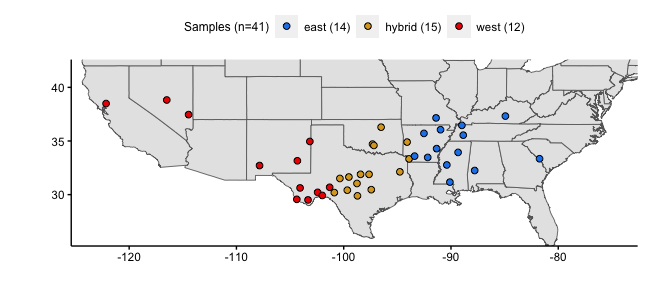
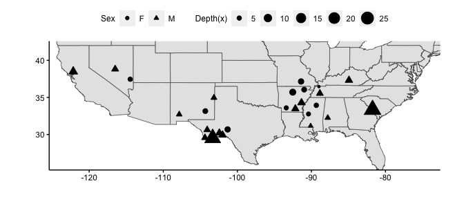
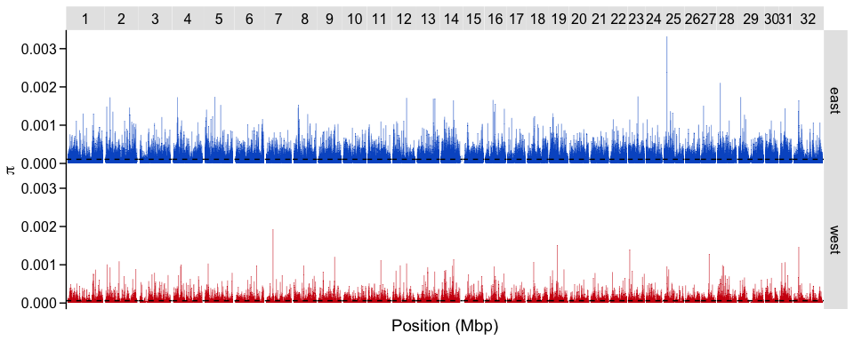
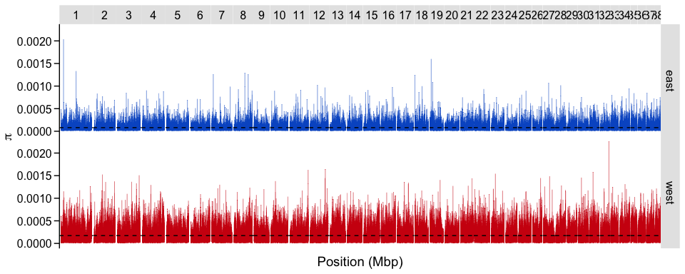

input
================

### Samples

focus on mainland foxes from Sacks only (remove one bad sample) *n=41
remaining*

figure out number of non-hybrid samples *n=26 (14 east + 12 west)*

<!-- -->

    ## # A tibble: 4 × 3
    ## # Groups:   Samples (n=41), Sex [4]
    ##   `Samples (n=41)` Sex       n
    ##   <chr>            <chr> <int>
    ## 1 east (14)        F         7
    ## 2 east (14)        M         7
    ## 3 west (12)        F         3
    ## 4 west (12)        M         9

split data in half

<!-- -->

Samples for smc++ (higher depth)

| Region | SRA         | Sex | State | Lat.   | Long.    | Depth |
|--------|-------------|-----|-------|--------|----------|-------|
| East   | SRR24465304 | M   | SC    | 33.346 | -81.743  | 26.2  |
| East   | SRR24465268 | F   | AR    | 35.708 | -92.519  | 7.2   |
| East   | SRR24465307 | M   | AR    | 34.287 | -91.338  | 6.4   |
| East   | SRR24465305 | M   | KY    | 37.322 | -84.928  | 6.3   |
| East   | SRR24465269 | M   | AR    | 33.467 | -92.169  | 6.2   |
| East   | SRR24465309 | F   | MO    | 37.152 | -91.391  | 6.2   |
| West   | SRR24465290 | M   | TX    | 29.508 | -103.328 | 23.6  |
| West   | SRR24465296 | M   | CA    | 38.490 | -122.152 | 7.7   |
| West   | SRR24465294 | M   | TX    | 29.924 | -101.992 | 6.4   |
| West   | SRR24465289 | M   | TX    | 30.213 | -102.430 | 6.1   |
| West   | SRR24465291 | F   | TX    | 30.684 | -101.308 | 6.1   |
| West   | SRR24465287 | M   | NV    | 38.821 | -116.494 | 5.8   |

Samples for empirical analysis

| Region | SRA         | Sex | State | Lat.   | Long.    | Depth |
|--------|-------------|-----|-------|--------|----------|-------|
| East   | SRR24465272 | M   | TN    | 35.543 | -88.856  | 5.7   |
| East   | SRR24465270 | F   | AR    | 36.052 | -90.973  | 5.6   |
| East   | SRR24465308 | F   | MS    | 33.937 | -89.337  | 5.1   |
| East   | SRR24465306 | F   | AR    | 33.588 | -93.391  | 4.9   |
| East   | SRR24465297 | F   | MS    | 32.766 | -90.388  | 4.8   |
| East   | SRR24465271 | M   | AL    | 32.248 | -87.791  | 4.8   |
| West   | SRR24465292 | M   | TX    | 29.561 | -104.372 | 5.5   |
| West   | SRR24465283 | F   | NM    | 33.156 | -104.321 | 5.5   |
| West   | SRR24465293 | M   | TX    | 30.625 | -104.067 | 5.5   |
| West   | SRR24465288 | F   | NV    | 37.459 | -114.460 | 5.0   |
| West   | SRR24465285 | M   | NM    | 34.956 | -103.157 | 5.0   |
| West   | SRR24465284 | M   | NM    | 32.711 | -107.845 | 4.9   |

### Genic Regions

create bed file of genes ±1kb from annotation

``` r
# annotation file
galba <- fread("~/Downloads/galba.gtf.gz")

# chromosome name conversion file 
chroms <- read_tsv("grayfox_renameChroms_number.txt", col_names = c("scaf","chrom")) %>% 
  separate(scaf, remove=F, c(NA,NA,NA,NA,NA,"length"))

# write file with chromosome sizes
chroms %>% select(scaf,length) %>% write_tsv("chromSizes.txt", col_names = F)

# filter annotation for genic regions
genes <- galba %>% filter(V3=="gene") %>% select(V1,V4,V5)

# add chromosome names to annotation file and remove stuff not mapping to scaffs 1-32
genescaf <- genes %>% left_join(chroms,by=c("V1"="scaf")) %>% 
  select(chrom,V4,V5, length)  %>%  na.omit()

# add 1kb to either end of each gene, 
## make sure values don't drop below zero or exceed the length of the chromosome
gene1kb <- genescaf %>% mutate(start=V4-1000, end=V5+1000) %>% 
  mutate(newstart=case_when(start<0 ~ 1, TRUE ~ start)) %>% 
  mutate(newend=case_when(end>as.numeric(length) ~ as.numeric(length), TRUE ~ end))

gene1kb %>% select(chrom,newstart,newend) %>% write_tsv("genes1kb.bed", col_names = F)
```

remove genic regions and compute summary statistics on half of data

``` bash
module load bedtools2
module load bcftools

bedtools sort -i genes1kb.bed > genicregions.1kb.bed

#removes genic regions
bcftools view -T ^genicregions.1kb.bed grayfox_filtered.renameChroms.Mainland.ACgr61_DPgr165lt500.vcf.gz -Oz -o grayfox_mainland_nogenes.vcf.gz 

bcftools index -t grayfox_mainland_nogenes.vcf.gz

#split by chromosome
bcftools index -s grayfox_mainland_nogenes.vcf.gz | cut -f 1 | while read C; do bcftools view -O z -o split.${C}.vcf.gz grayfox_mainland_nogenes.vcf.gz "${C}" ; done
```

### Compute Summary Statistics

calculate pi, segregating sites, heterozygosity per site on n=12
empirical samples

``` bash
#!/bin/sh
#SBATCH --job-name=statsvcfsite
#SBATCH --output=/scratch1/marjanak/statsvcfsite.out
#SBATCH --error=/scratch1/marjanak/statsvcfsite.err
#SBATCH --partition=qcb
#SBATCH --time=30:00:00
#SBATCH --ntasks=1
#SBATCH --cpus-per-task=4
#SBATCH --mem-per-cpu=8000MB
#SBATCH --mail-type=END,FAIL # notifications for job done & fail
#SBATCH --mail-user=marjanak@usc.edu

module load vcftools

vcftools --gzvcf /project/jazlynmo_738/DataRepository/Canids/Invariant/GrayFox/Mainland/grayfox_filtered.renameChroms.Mainland.ACgr61_DPgr165lt500.gvcf.gz --keep east6.txt --exclude-bed genicregions.1kb.bed --site-pi --out east6_pi_site.out

vcftools --gzvcf /project/jazlynmo_738/DataRepository/Canids/Invariant/GrayFox/Mainland/grayfox_filtered.renameChroms.Mainland.ACgr61_DPgr165lt500.gvcf.gz --keep west6.txt --exclude-bed genicregions.1kb.bed --site-pi --out west6_pi_site.out


vcftools --gzvcf /project/jazlynmo_738/Maria/grayfox_mainland_nogenes.vcf.gz --keep east6.txt --snpdensity 10 --out east6_S_10bp.out

vcftools --gzvcf /project/jazlynmo_738/Maria/grayfox_mainland_nogenes.vcf.gz --keep west6.txt --snpdensity 10 --out west6_S_10bp.out
```

Average nucleotide diversity 1.8x higher in the east (n=6) compared to
the west (n=6) when mapped to grayfox genome

Average nucleotide diversity 2.2x higher in the west (n=6) compared to
the east (n=6) when mapped to canfam3.1

    ## # A tibble: 2 × 2
    ##   pop       avgpi
    ##   <chr>     <dbl>
    ## 1 east  0.000108 
    ## 2 west  0.0000611

<!-- -->

    ## # A tibble: 2 × 2
    ##   pop       avgpi
    ##   <chr>     <dbl>
    ## 1 east  0.0000800
    ## 2 west  0.000173

<!-- -->
