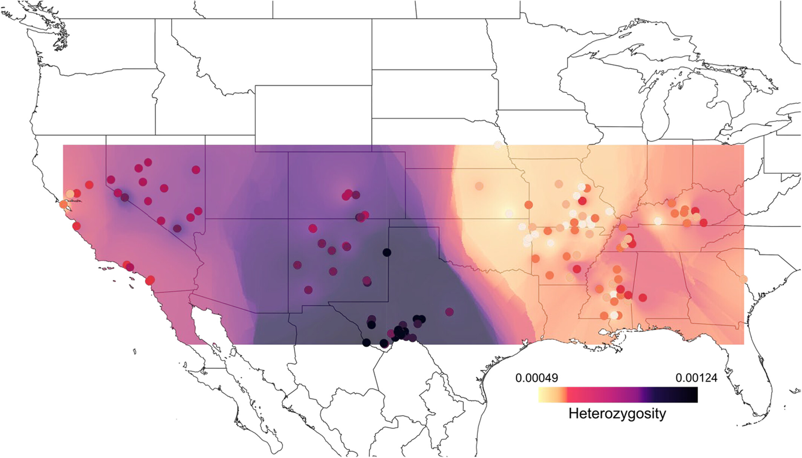
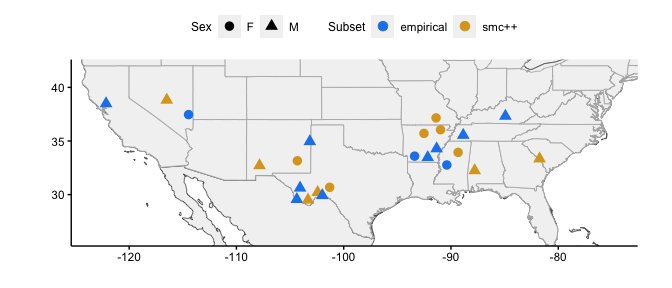
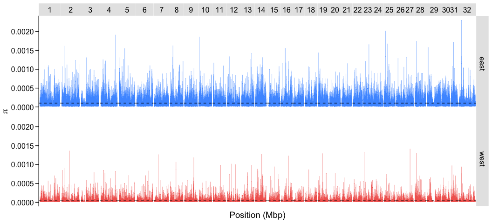
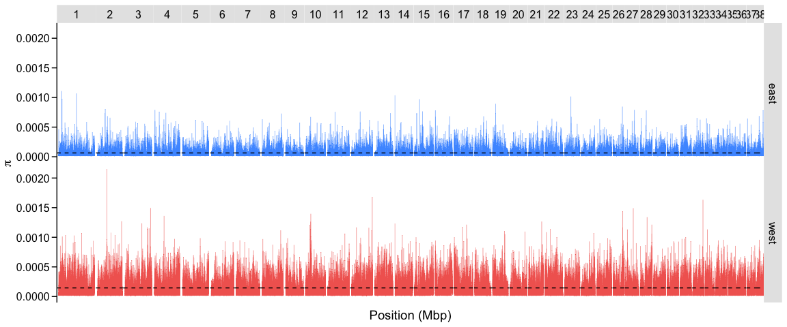

Filtered 2024
================

-   [Previous Results](#previous-results)
-   [Reanalysis](#reanalysis)
    -   [Samples](#samples)
    -   [Genic Regions](#genic-regions)
    -   [Summary Statistics](#summary-statistics)
    -   [Split VCF by pop and count
        alleles](#split-vcf-by-pop-and-count-alleles)

## Previous Results

> Preckler-Quisquater et al. (2023). Can demographic histories explain
> long-term isolation and recent pulses of asymmetric gene flow between
> highly divergent grey fox lineages? Molecular Ecology, 32, 5323–5337.
> <https://doi.org/10.1111/mec.17105>

Identified significantly **lower overall heterozygosity** in the **east
(6.0×10<sup>−4</sup>)** relative to the **west (9.8×10<sup>−4</sup>)**
(p«.001) and observed a decrease in heterozygosity along a northwest
gradient in the eastern lineage:



## Reanalysis

### Samples

<table>
<caption>
Samples for Empirical Analysis
</caption>
<thead>
<tr>
<th style="text-align:left;">
East
</th>
<th style="text-align:left;">
West
</th>
</tr>
</thead>
<tbody>
<tr>
<td style="text-align:left;">
SRR24465306
</td>
<td style="text-align:left;">
SRR24465296
</td>
</tr>
<tr>
<td style="text-align:left;">
SRR24465269
</td>
<td style="text-align:left;">
SRR24465288
</td>
</tr>
<tr>
<td style="text-align:left;">
SRR24465307
</td>
<td style="text-align:left;">
SRR24465292
</td>
</tr>
<tr>
<td style="text-align:left;">
SRR24465297
</td>
<td style="text-align:left;">
SRR24465293
</td>
</tr>
<tr>
<td style="text-align:left;">
SRR24465272
</td>
<td style="text-align:left;">
SRR24465285
</td>
</tr>
<tr>
<td style="text-align:left;">
SRR24465305
</td>
<td style="text-align:left;">
SRR24465294
</td>
</tr>
</tbody>
</table>

<!-- -->

### Genic Regions

create bed file of genes ±1kb from annotation

<details>
<summary>
Show code
</summary>

<br>

``` r
##Canfam3.1 annotation

chroms <- read_tsv("sumstats_files/canfamchrom.txt")

cfgenes <- read_tsv("sumstats_files/canFam3.1_ensembleGenes", col_names = T) %>% 
  left_join(chroms, by=c("chrom"="Chromosome")) %>% 
  filter(str_detect(chrom, "chr\\d")) %>%  
  mutate(newstart=txStart-1000, newend=txEnd+1000) %>% 
  mutate(start=case_when(newstart<0 ~ 1, TRUE ~ newstart)) %>%
  mutate(end=case_when(newend>as.numeric(Size) ~ as.numeric(Size), TRUE ~ newend)) %>%
  select(chrom,start,end)

mergecf <- bed_merge(cfgenes)

mergecf %>% write_tsv("sumstats_files/cfgenes1kb.bed", col_names = F)


#Grayfox liftover annotation

galba <- fread("sumstats_files/galba.gtf.gz")

chroms <- read_tsv("inputstats_files/grayfox_renameChroms_number.txt", col_names = c("scaf","chrom")) %>% 
  separate(scaf, remove=F, c(NA,NA,NA,NA,NA,"length"))

gfgenes <- galba %>% left_join(chroms,by=c("V1"="scaf")) %>% na.omit() %>%
  mutate(newstart=V4-1000, newend=V5+1000) %>% 
  mutate(start=case_when(newstart<0 ~ 1, TRUE ~ newstart)) %>%
  mutate(end=case_when(newend>as.numeric(length) ~ as.numeric(length), TRUE ~ newend)) %>%
  select(chrom,start,end)

mergegf <- bed_merge(gfgenes)

mergegf %>% write_tsv("sumstats_files/gfgenes1kb.bed", col_names = F)
```

</details>

### Summary Statistics

<details>
<summary>
Show code
</summary>

<br>

``` bash
#!/bin/sh
#SBATCH --job-name=varpi10kb
#SBATCH --output=/scratch1/marjanak/varpi10kb.out
#SBATCH --error=/scratch1/marjanak/varpi10kb.err
#SBATCH --partition=qcb
#SBATCH --time=30:00:00
#SBATCH --ntasks=1
#SBATCH --cpus-per-task=4
#SBATCH --mem-per-cpu=8000MB
#SBATCH --mail-type=END,FAIL # notifications for job done & fail
#SBATCH --mail-user=marjanak@usc.edu

module load vcftools
module load bcftools

vcftools --gzvcf /project/jazlynmo_738/DataRepository/Canids/Variants/GrayFox/Mainland/grayfox_filtered.renameChroms.Mainland.drop295.ACgr25_DPgr165lt500.vcf.gz --keep east6.txt --exclude-bed gfgenes1kb.bed --window-pi 10000 --out gf_east6_pi_10kb.out

vcftools --gzvcf /project/jazlynmo_738/DataRepository/Canids/Variants/GrayFox/Mainland/Canfam3.1_filtered.renameChroms.Mainland.drop295.ACgr25_DPgr165lt500.vcf.gz --keep east6.txt --exclude-bed cfgenes1kb.bed --window-pi 10000 --out cf_east6_pi_10kb.out

vcftools --gzvcf /project/jazlynmo_738/DataRepository/Canids/Variants/GrayFox/Mainland/grayfox_filtered.renameChroms.Mainland.drop295.ACgr25_DPgr165lt500.vcf.gz --keep west6.txt --exclude-bed gfgenes1kb.bed --window-pi 10000 --out gf_west6_pi_10kb.out

vcftools --gzvcf /project/jazlynmo_738/DataRepository/Canids/Variants/GrayFox/Mainland/Canfam3.1_filtered.renameChroms.Mainland.drop295.ACgr25_DPgr165lt500.vcf.gz --keep west6.txt --exclude-bed cfgenes1kb.bed --window-pi 10000 --out cf_west6_pi_10kb.out

vcftools --gzvcf /project/jazlynmo_738/DataRepository/Canids/Variants/GrayFox/Mainland/grayfox_filtered.renameChroms.Mainland.drop295.ACgr25_DPgr165lt500.vcf.gz --keep empirical.txt --exclude-bed gfgenes1kb.bed --het --out grayfox.het

vcftools --gzvcf /project/jazlynmo_738/DataRepository/Canids/Variants/GrayFox/Mainland/Canfam3.1_filtered.renameChroms.Mainland.drop295.ACgr25_DPgr165lt500.vcf.gz --keep empirical.txt --exclude-bed cfgenes1kb.bed --het --out canfam31.het

bcftools stats -S empirical.txt -T ^gfgenes1kb.bed /project/jazlynmo_738/DataRepository/Canids/Variants/GrayFox/Mainland/grayfox_filtered.renameChroms.Mainland.drop295.ACgr25_DPgr165lt500.vcf.gz > grayfox.seg

bcftools stats -S empirical.txt -T ^cfgenes1kb.bed /project/jazlynmo_738/DataRepository/Canids/Variants/GrayFox/Mainland/Canfam3.1_filtered.renameChroms.Mainland.drop295.ACgr25_DPgr165lt500.vcf.gz > canfam31.seg
```

</details>

### Split VCF by pop and count alleles

<details>
<summary>
Show code for Grayfox
</summary>

<br>

``` bash
#!/bin/sh
#SBATCH --job-name=sepvcf
#SBATCH --output=/scratch1/marjanak/sepvcf.out
#SBATCH --error=/scratch1/marjanak/sepvcf.err
#SBATCH --partition=qcb
#SBATCH --time=10:00:00
#SBATCH --ntasks=1
#SBATCH --cpus-per-task=4
#SBATCH --mem-per-cpu=8000MB
#SBATCH --mail-type=END,FAIL # notifications for job done & fail
#SBATCH --mail-user=marjanak@usc.edu

module load bcftools

bcftools view -Oz -S west6.txt /project/jazlynmo_738/DataRepository/Canids/Variants/GrayFox/Mainland/grayfox_filtered.renameChroms.Mainland.drop295.ACgr25_DPgr165lt500.vcf.gz > west6.vcf.gz

bcftools view -Oz -S east6.txt /project/jazlynmo_738/DataRepository/Canids/Variants/GrayFox/Mainland/grayfox_filtered.renameChroms.Mainland.drop295.ACgr25_DPgr165lt500.vcf.gz > east6.vcf.gz

bcftools index -t west6.vcf.gz

bcftools index -t east6.vcf.gz

vcftools --gzvcf east6.vcf.gz --counts --exclude-bed gfgenes1kb.bed

vcftools --gzvcf west6.vcf.gz --counts --exclude-bed gfgenes1kb.bed
```

</details>

<br>

<details>
<summary>
Show code for CanFam3.1
</summary>

<br>

``` bash
#!/bin/sh
#SBATCH --job-name=cfsepvcf
#SBATCH --output=/scratch1/marjanak/cfsepvcf.out
#SBATCH --error=/scratch1/marjanak/cfsepvcf.err
#SBATCH --partition=qcb
#SBATCH --time=10:00:00
#SBATCH --ntasks=1
#SBATCH --cpus-per-task=4
#SBATCH --mem-per-cpu=8000MB
#SBATCH --mail-type=END,FAIL # notifications for job done & fail
#SBATCH --mail-user=marjanak@usc.edu

module load bcftools
module load vcftools

bcftools view -Oz -S west6.txt /project/jazlynmo_738/DataRepository/Canids/Variants/GrayFox/Mainland/Canfam3.1_filtered.renameChroms.Mainland.drop295.ACgr25_DPgr165lt500.vcf.gz > cfwest6.vcf.gz

bcftools view -Oz -S east6.txt /project/jazlynmo_738/DataRepository/Canids/Variants/GrayFox/Mainland/Canfam3.1_filtered.renameChroms.Mainland.drop295.ACgr25_DPgr165lt500.vcf.gz > cfeast6.vcf.gz

bcftools index -t cfwest6.vcf.gz

bcftools index -t cfeast6.vcf.gz

vcftools --gzvcf cfeast6.vcf.gz --counts --exclude-bed cfgenes1kb.bed --out cfeast

vcftools --gzvcf cfwest6.vcf.gz --counts --exclude-bed cfgenes1kb.bed --out cfwest
```

</details>

<br>

<table>
<thead>
<tr>
<th style="text-align:left;">
east
</th>
<th style="text-align:left;">
west
</th>
<th style="text-align:right;">
count.gf
</th>
<th style="text-align:left;">
perc.gf
</th>
<th style="text-align:right;">
count.cf
</th>
<th style="text-align:left;">
perc.cf
</th>
</tr>
</thead>
<tbody>
<tr>
<td style="text-align:left;">
polymorphic
</td>
<td style="text-align:left;">
fixed der
</td>
<td style="text-align:right;">
208793
</td>
<td style="text-align:left;">
58.4%
</td>
<td style="text-align:right;">
151516
</td>
<td style="text-align:left;">
1.3%
</td>
</tr>
<tr>
<td style="text-align:left;">
fixed der
</td>
<td style="text-align:left;">
fixed der
</td>
<td style="text-align:right;">
73459
</td>
<td style="text-align:left;">
20.5%
</td>
<td style="text-align:right;">
11139465
</td>
<td style="text-align:left;">
94.4%
</td>
</tr>
<tr>
<td style="text-align:left;">
polymorphic
</td>
<td style="text-align:left;">
polymorphic
</td>
<td style="text-align:right;">
60901
</td>
<td style="text-align:left;">
17.0%
</td>
<td style="text-align:right;">
57885
</td>
<td style="text-align:left;">
0.5%
</td>
</tr>
<tr>
<td style="text-align:left;">
fixed der
</td>
<td style="text-align:left;">
polymorphic
</td>
<td style="text-align:right;">
14490
</td>
<td style="text-align:left;">
4.1%
</td>
<td style="text-align:right;">
456703
</td>
<td style="text-align:left;">
3.9%
</td>
</tr>
<tr>
<td style="text-align:left;">
fixed anc
</td>
<td style="text-align:left;">
fixed der
</td>
<td style="text-align:right;">
5
</td>
<td style="text-align:left;">
0.0%
</td>
<td style="text-align:right;">
9
</td>
<td style="text-align:left;">
0.0%
</td>
</tr>
<tr>
<td style="text-align:left;">
fixed anc
</td>
<td style="text-align:left;">
polymorphic
</td>
<td style="text-align:right;">
1
</td>
<td style="text-align:left;">
0.0%
</td>
<td style="text-align:right;">
1
</td>
<td style="text-align:left;">
0.0%
</td>
</tr>
<tr>
<td style="text-align:left;">
Total
</td>
<td style="text-align:left;">

-   </td>
    <td style="text-align:right;">
    357649
    </td>
    <td style="text-align:left;">

    -   </td>
        <td style="text-align:right;">
        11805579
        </td>
        <td style="text-align:left;">

        -   </td>
            </tr>
            </tbody>
            </table>

<br>

> For genome comparisons, pi calculated in 10kb windows

#### Mapped to Gray Fox Genome

Average nucleotide diversity **1.8x higher in the east** (n=6) compared
to the west (n=6) when mapped to **grayfox genome**

<table>
<thead>
<tr>
<th style="text-align:left;">
pop
</th>
<th style="text-align:left;">
avgpi
</th>
</tr>
</thead>
<tbody>
<tr>
<td style="text-align:left;">
east
</td>
<td style="text-align:left;">
1.04e-04
</td>
</tr>
<tr>
<td style="text-align:left;">
west
</td>
<td style="text-align:left;">
5.78e-05
</td>
</tr>
</tbody>
</table>

<!-- -->

#### Mapped to Canfam3.1

Average nucleotide diversity **2.3x higher in the west** (n=6) compared
to the east (n=6) when mapped to **canfam3.1**

<table>
<thead>
<tr>
<th style="text-align:left;">
pop
</th>
<th style="text-align:left;">
avgpi
</th>
</tr>
</thead>
<tbody>
<tr>
<td style="text-align:left;">
east
</td>
<td style="text-align:left;">
6.41e-05
</td>
</tr>
<tr>
<td style="text-align:left;">
west
</td>
<td style="text-align:left;">
1.45e-04
</td>
</tr>
</tbody>
</table>

<!-- -->
